# Component Interaction Design

## 1. Overview

This document provides detailed interaction patterns and flow designs for the Craftplan + elrmcp integration architecture. It covers the bidirectional communication between components, data flow patterns, and interaction scenarios.

## 2. Component Interaction Patterns

### 2.1 elrmcp Gateway Architecture

The elrmcp gateway serves as the central routing and translation hub for all interactions:

```ermaid
graph TB
    subgraph "elrmcp Gateway (8888)"
        GW[Gateway Core]
        AUTH[Authentication]
        ROUTER[Protocol Router]
        TRANS[Translation Engine]
        CACHE[Cache Layer]
        MON[Monitoring]
    end

    subgraph "Client Applications"
        WEB[Web Client]
        API[REST API Client]
        CLI[CLI Tool]
        AI[AI Assistant]
    end

    subgraph "Backend Services"
        CP[Craftplan MCP]
        ERP[elrmcp Server]
        A2A[A2A Agent]
        LOCAL[Local ERP]
    end

    WEB --> GW
    API --> GW
    CLI --> GW
    AI --> GW

    GW --> AUTH
    AUTH --> ROUTER
    ROUTER --> TRANS
    TRANS --> CACHE
    CACHE --> MON

    TRANS --> CP
    TRANS --> ERP
    TRANS --> A2A
    TRANS --> LOCAL
```

### 2.2 Interaction Flow Layers

```
┌─────────────────────────────────────────────────────────────────────────────────────────────────────┐
│                                            Application Layer                                       │
│         ┌─────────────────┐    ┌─────────────────┐    ┌─────────────────┐    ┌─────────────────┐    │
│         │   Web Client    │    │   API Client    │    │   CLI Tool     │    │   AI Assistant  │    │
│         └─────────┬────────┘    └─────────┬────────┘    └─────────┬────────┘    └─────────┬────────┘    │
│                  │                        │                        │                        │        │
│                  └────────────────────────┼────────────────────────┼────────────────────────┘        │
│                                             │                        │                         │
└────────────────────────────────────────────┼────────────────────────┼─────────────────────────────┘
                                              │                        │
┌────────────────────────────────────────────▼────────────────────────▼─────────────────────────────────┐
│                                           Gateway Layer                                          │
│         ┌─────────────────────────────────────────────────────────────────────────────────────────┐ │
│         │                    elrmcp Gateway (8888)                                              │ │
│         │  • Authentication Service                                                             │ │
│         │  • Protocol Router                                                                    │ │
│         │  • Translation Engine                                                                │ │
│         │  • Cache Layer                                                                       │ │
│         │  • Monitoring Service                                                                 │ │
│         └─────────────────────────────────────────────────────────────────────────────────────────┘ │
│                                             │                                                         │
│        ┌───────────────────────────────────▼─────────────────────────────────┐  ┌─────────────────────▼─────────────────────────────────┐ │
│        │              MCP Protocol Translation                            │  │              Service Discovery                          │ │
│        │  • elrmcp → Craftplan Mapping                                   │  │  • Dynamic Service Registration                         │ │
│        │  • Craftplan → elrmcp Mapping                                   │  │  • Health Check Service                                 │ │
│        │  • A2A → MCP Tools Mapping                                       │  │  • Load Balancer Service                                │ │
│        │  • MCP → A2A Skills Mapping                                     │  │  • Configuration Management                              │ │
│        └─────────────────────────────────────────────────────────────────────┘  └─────────────────────────────────────────────────────┘ │
│                                                                                                                     │
└───────────────────────────────────────────────────────────────────────────────────────────────────────────────────────┘
                                              │
┌────────────────────────────────────────────▼─────────────────────────────────────────────────────────────────┐
│                                           Service Layer                                          │
│         ┌─────────────────┐    ┌─────────────────┐    ┌─────────────────┐    ┌─────────────────┐    │
│         │ Craftplan MCP    │    │   elrmcp        │    │   A2A Agent     │    │   Local ERP     │    │
│         │ Server (8090)   │    │   Server        │    │   Service       │    │   Integration   │    │
│         │                 │    │   (8765)        │    │   (8080)        │    │   (8766)        │    │
│         │ • MCP Tools:    │    │ • MCP Tools:   │    │ • Agent Skills: │    │ • MCP Adapter:  │    │
│         │   - Customer    │    │   - Inventory   │    │   - Order       │    │   - Local ERP   │    │
│         │   - Order       │    │   - Accounting  │    │   - Customer    │    │   Integration   │    │
│         │   - Inventory   │    │   - HR          │    │   - Inventory   │    │                 │    │
│         │   - Production  │    │   - Payroll     │    │   - Production  │    │                 │    │
│         │   - Analytics   │    │   - Reporting   │    │   - Analytics   │    │                 │    │
│         │   - Shipping    │    │   - Procurement │    │   - Shipping    │    │                 │    │
│         └─────────┬────────┘    └─────────┬────────┘    └─────────┬────────┘    └─────────┬────────┘    │
│                  │                        │                        │                        │        │
│                  └────────────────────────┼────────────────────────┼────────────────────────┘        │
│                                             │                        │                         │
└────────────────────────────────────────────┼────────────────────────┼─────────────────────────────┘
                                              │                        │
┌────────────────────────────────────────────▼────────────────────────▼─────────────────────────────────┐
│                                       Infrastructure Layer                                       │
│         ┌─────────────────────────────────────────────────────────────────────────────────────────┐ │
│         │                Service Mesh (Istio/Linkerd)                                          │ │
│         │  • Traffic Management                                                               │ │
│         │  • Service Discovery                                                                │ │
│         │  • Security (mTLS, RBAC)                                                           │ │
│         │  • Observability (Metrics, Tracing, Logging)                                         │ │
│         └─────────────────────────────────────────────────────────────────────────────────────────┘ │
│                                             │                                                         │
│        ┌───────────────────────────────────▼─────────────────────────────────┐  ┌─────────────────────▼─────────────────────────────────┐ │
│        │                      Data Layer                                    │  │                 External Integrations                  │ │
│        │  • PostgreSQL (Primary DB)                                        │  │  • Email Service (SMTP)                                 │ │
│        │  • Redis (Cache, Session)                                         │  │  • SMS Service (Twilio)                                  │ │
│        │  • MinIO (File Storage)                                           │  │  • Payment Gateway (Stripe/PayPal)                       │ │
│        │  • Message Queue (RabbitMQ)                                       │  │  • External APIs (3rd Party Services)                   │ │
│        └─────────────────────────────────────────────────────────────────────┘  └─────────────────────────────────────────────────────┘ │
│                                                                                                                     │
└───────────────────────────────────────────────────────────────────────────────────────────────────────────────────────┘
```

## 3. Detailed Interaction Scenarios

### 3.1 Client → elrmcp → Craftplan MCP Flow

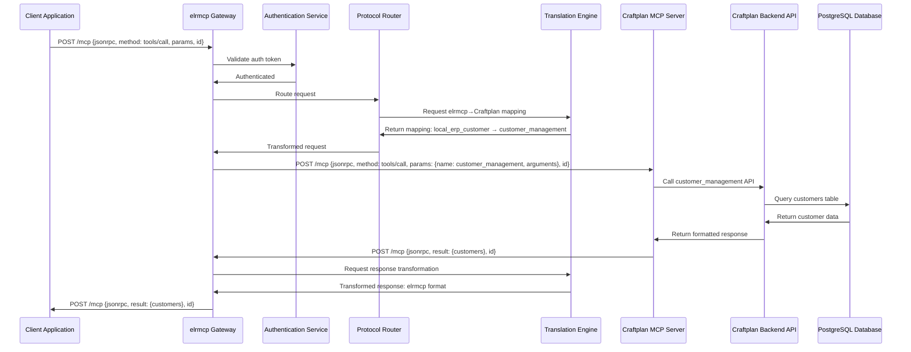

### 3.2 Client → elrmcp → elrmcp Server Flow

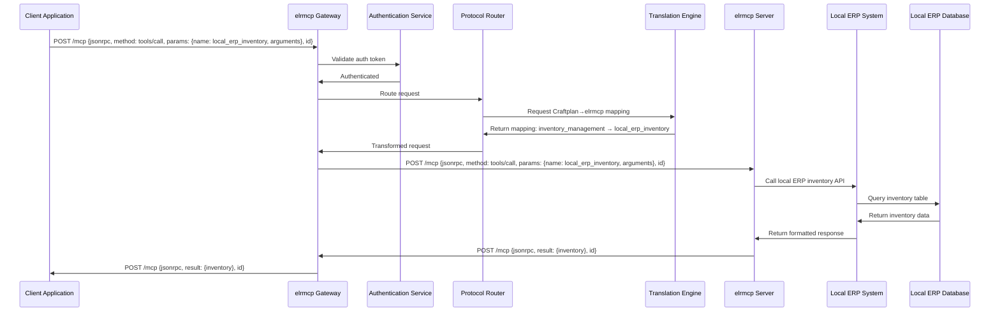

### 3.3 A2A Task → MCP Tools Flow

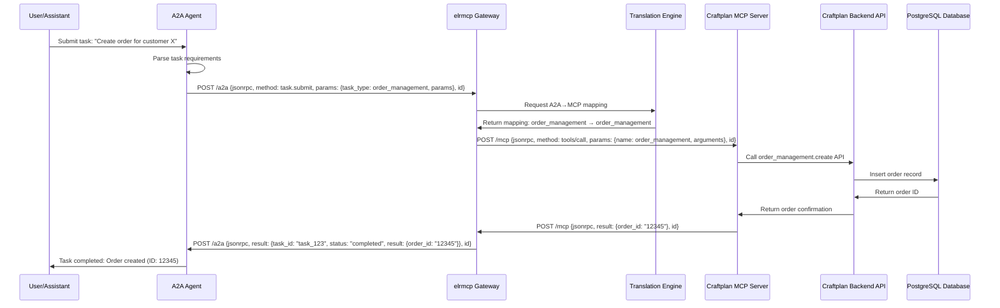

### 3.4 Multi-Agent Workflow Flow

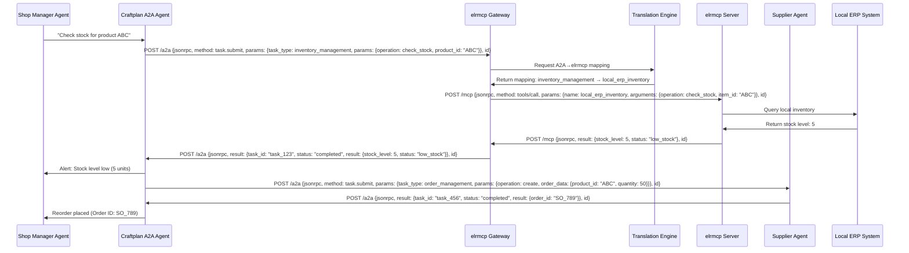

### 3.5 Real-time Updates via SSE

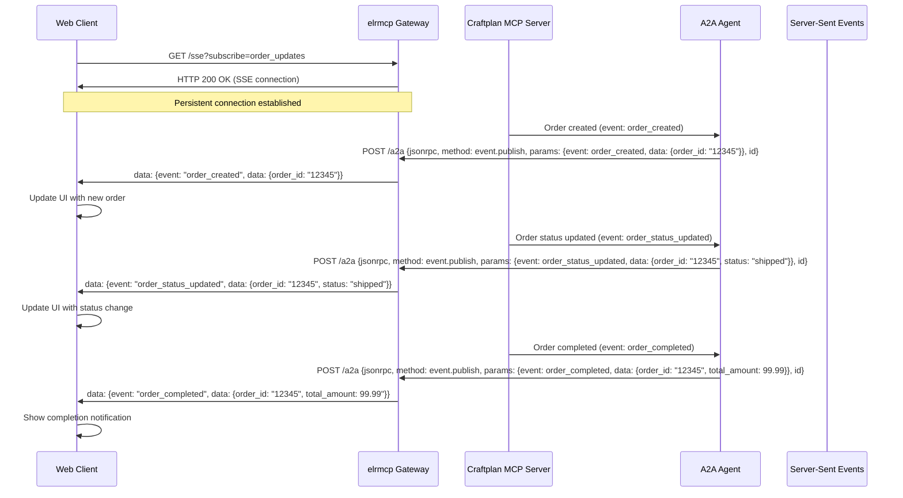

## 4. Error Handling and Recovery

### 4.1 Error Handling Flow

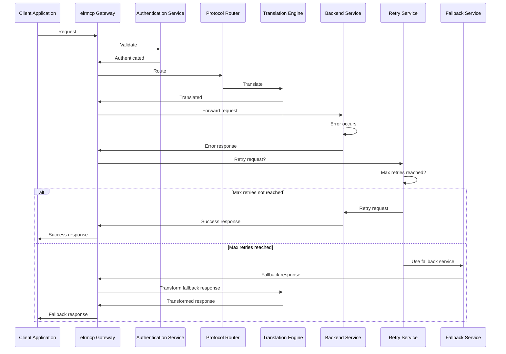

### 4.2 Error Types and Handling

```erlang
%% Error type definitions
-record(error_type, {
    code :: integer(),
    message :: binary(),
    category :: authentication | validation | business | system | network,
    severity :: info | warning | error | critical,
    recovery_strategy :: retry | fallback | manual | terminate,
    retry_config :: map()
}).

%% Error handling configuration
-define(ERROR_CONFIG, #{
    %% Authentication errors
    {401, "unauthorized"} => #error_type{
        code = 401,
        message = "Unauthorized access",
        category = authentication,
        severity = warning,
        recovery_strategy = retry,
        retry_config = #{max_attempts => 0, delay => 0}
    },

    {403, "forbidden"} => #error_type{
        code = 403,
        message = "Access forbidden",
        category = authentication,
        severity = error,
        recovery_strategy = terminate,
        retry_config = #{}
    },

    %% Validation errors
    {4001, "invalid_request"} => #error_type{
        code = 4001,
        message = "Invalid request format",
        category = validation,
        severity = warning,
        recovery_strategy = manual,
        retry_config = #{}
    },

    {4003, "invalid_params"} => #error_type{
        code = 4003,
        message = "Invalid parameters",
        category = validation,
        severity = warning,
        recovery_strategy = manual,
        retry_config = #{}
    },

    %% Business logic errors
    {4004, "customer_not_found"} => #error_type{
        code = 4004,
        message = "Customer not found",
        category = business,
        severity = error,
        recovery_strategy = fallback,
        retry_config = #{max_attempts => 0, delay => 0}
    },

    {4006, "insufficient_stock"} => #error_type{
        code = 4006,
        message = "Insufficient stock",
        category = business,
        severity = error,
        recovery_strategy = retry,
        retry_config = #{max_attempts => 3, delay => 5000}
    },

    %% System errors
    {5001, "internal_error"} => #error_type{
        code = 5001,
        message = "Internal server error",
        category = system,
        severity = critical,
        recovery_strategy = retry,
        retry_config = #{max_attempts => 5, delay => 10000}
    },

    {5031, "service_unavailable"} => #error_type{
        code = 5031,
        message = "Service unavailable",
        category = network,
        severity = critical,
        recovery_strategy = retry,
        retry_config = #{max_attempts => 10, delay => 30000}
    }
}).
```

### 4.3 Error Transformation and Response

```erlang
%% Error transformation function
transform_error(SourceError, SourceSystem, TargetSystem) ->
    case maps:get(SourceError#error.code, ?ERROR_CONFIG, undefined) of
        undefined ->
            %% Unknown error, use generic transformation
            generic_error_transform(SourceError, SourceSystem, TargetSystem);
        ErrorConfig ->
            %% Transform error based on configuration
            transform_error_with_config(SourceError, ErrorConfig, SourceSystem, TargetSystem)
    end.

%% Generic error transformation
generic_error_transform(SourceError, SourceSystem, TargetSystem) ->
    #{
        <<"code">> => SourceError#error.code,
        <<"message">> => SourceError#error.message,
        <<"data">> => #{
            <<"source_system">> => SourceSystem,
            <<"target_system">> => TargetSystem,
            <<"original_error">> => SourceError
        }
    }.

%% Configured error transformation
transform_error_with_config(SourceError, ErrorConfig, SourceSystem, TargetSystem) ->
    TargetCode = case TargetSystem of
        craftplan -> convert_to_craftplan_code(ErrorConfig#error.code);
        elrmcp -> convert_to_elrmcp_code(ErrorConfig#error.code);
        a2a -> convert_to_a2a_code(ErrorConfig#error.code)
    end,

    TargetMessage = convert_to_target_message(ErrorConfig#error.message, TargetSystem),

    #{
        <<"code">> => TargetCode,
        <<"message">> => TargetMessage,
        <<"data">> => #{
            <<"category">> => ErrorConfig#error.category,
            <<"severity">> => ErrorConfig#error.severity,
            <<"recovery_strategy">> => ErrorConfig#error.recovery_strategy,
            <<"original_error">> => SourceError
        }
    }.
```

## 5. Performance Optimization

### 5.1 Caching Strategy

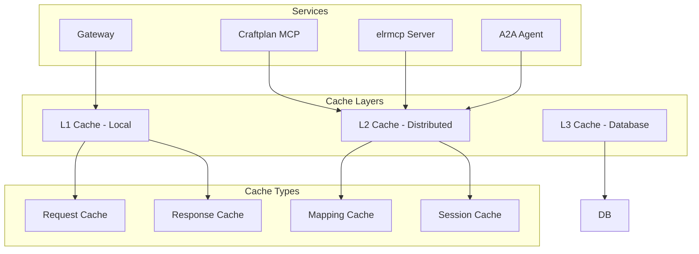

### 5.2 Request Caching

```erlang
%% Request cache key generation
generate_cache_key(System, Tool, Arguments) ->
    ArgsString = jiffy:encode(Arguments),
    Hash = crypto:hash(sha256, [System, Tool, ArgsString]),
    base64:encode(Hash).

%% Cache lookup function
cache_lookup(System, Tool, Arguments) ->
    CacheKey = generate_cache_key(System, Tool, Arguments),
    case cache:get(CacheKey) of
        {ok, CachedResponse} ->
            {hit, CachedResponse};
        {error, not_found} ->
            {miss, CacheKey}
    end.

%% Cache store function
cache_store(System, Tool, Arguments, Response, TTL) ->
    CacheKey = generate_cache_key(System, Tool, Arguments),
    CacheEntry = #{
        system => System,
        tool => Tool,
        arguments => Arguments,
        response => Response,
        timestamp => erlang:timestamp(),
        ttl => TTL
    },
    cache:set(CacheKey, CacheEntry, TTL).
```

### 5.3 Batch Processing

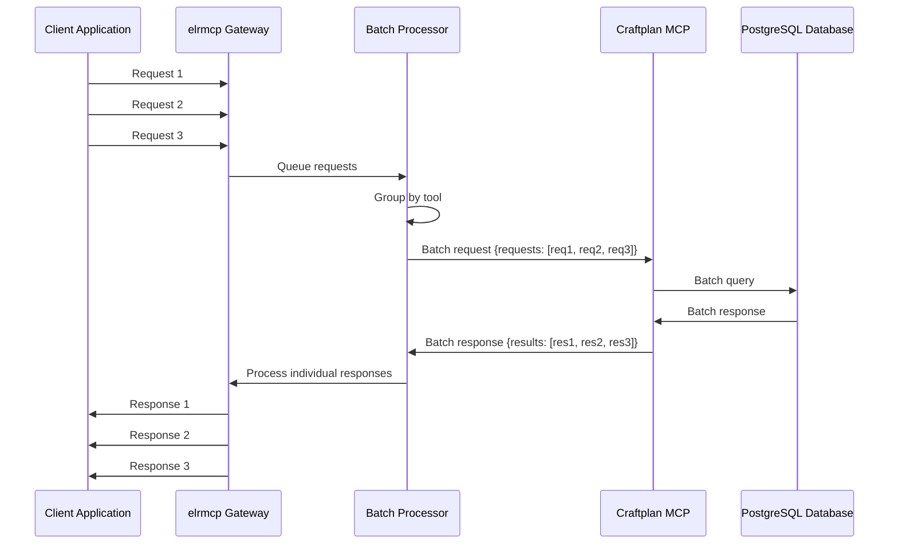

## 6. Security and Authentication

### 6.1 Authentication Flow

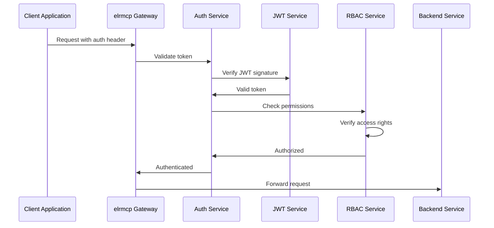

### 6.2 Authorization Matrix

```erlang
%% Role-based access control
-record(role_permission, {
    role :: binary(),
    system :: binary(),
    tools :: list(),
    operations :: list(),
    allowed :: boolean()
}).

%% Role definitions
-define(ROLES, [
    #role_permission{
        role = "admin",
        system = "all",
        tools = ["customer_management", "order_management", "inventory_management", "production_planning", "analytics", "shipping"],
        operations = ["create", "read", "update", "delete", "list"],
        allowed = true
    },
    #role_permission{
        role = "manager",
        system = "craftplan",
        tools = ["customer_management", "order_management", "inventory_management", "analytics"],
        operations = ["create", "read", "update", "list"],
        allowed = true
    },
    #role_permission{
        role = "clerk",
        system = "craftplan",
        tools = ["customer_management", "order_management"],
        operations = ["read", "create", "update"],
        allowed = true
    },
    #role_permission{
        role = "viewer",
        system = "craftplan",
        tools = ["customer_management", "order_management", "inventory_management"],
        operations = ["read", "list"],
        allowed = true
    }
]).

%% Permission checking function
check_permission(UserRole, System, Tool, Operation) ->
    case lists:filter(fun(#role_permission{role = R}) ->
        R =:= UserRole
    end, ?ROLES) of
        [Permission] ->
            case Permission#role_permission.system of
                "all" ->
                    lists:member(Tool, Permission#role_permission.tools)
                    and lists:member(Operation, Permission#role_permission.operations);
                System ->
                    lists:member(Tool, Permission#role_permission.tools)
                    and lists:member(Operation, Permission#role_permission.operations);
                _ ->
                    false
            end;
        _ ->
            false
    end.
```

### 6.3 Security Headers and Validation

```erlang
%% Security validation
validate_security_headers(Request) ->
    %% Check required headers
    RequiredHeaders = ["x-request-id", "x-client-version", "x-api-key"],
    MissingHeaders = lists:foldl(fun(Header, Acc) ->
        case maps:is_key(Header, Request) of
            true -> Acc;
            false -> [Header | Acc]
        end
    end, [], RequiredHeaders),

    case MissingHeaders of
        [] -> valid;
        _ -> {error, missing_headers, MissingHeaders}
    end.

%% Input sanitization
sanitize_input(Data) ->
    case is_binary(Data) of
        true ->
            %% Remove potentially harmful characters
            Sanitized = re:replace(Data, "[<>\"'&]", "", [{return, binary}]),
            case binary:match(Sanitized, <<"\0">>) of
                nomatch -> Sanitized;
                _ -> <<>>
            end;
        false -> Data
    end.
```

## 7. Monitoring and Observability

### 7.1 Metrics Collection

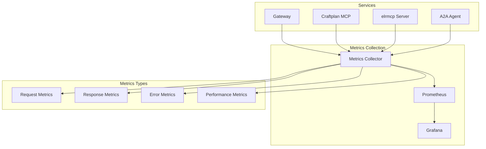

### 7.2 Metrics Definitions

```erlang
%% Metric definitions
-record(metric, {
    name :: binary(),
    type :: counter | gauge | histogram | summary,
    description :: binary(),
    labels :: list(),
    value :: number()
}).

%% Core metrics
-define(METRICS, [
    #metric{
        name = "elrmcp_requests_total",
        type = counter,
        description = "Total number of requests processed",
        labels = ["system", "tool", "status"],
        value = 0
    },
    #metric{
        name = "elrmcp_request_duration_seconds",
        type = histogram,
        description = "Request processing time",
        labels = ["system", "tool"],
        value = 0
    },
    #metric{
        name = "elrmcp_errors_total",
        type = counter,
        description = "Total number of errors",
        labels = ["system", "tool", "error_type"],
        value = 0
    },
    #metric{
        name = "elrmcp_active_connections",
        type = gauge,
        description = "Number of active connections",
        labels = ["system"],
        value = 0
    },
    #metric{
        name = "elrmcp_cache_hits_total",
        type = counter,
        description = "Total number of cache hits",
        labels = ["system"],
        value = 0
    },
    #metric{
        name = "elrmcp_cache_misses_total",
        type = counter,
        description = "Total number of cache misses",
        labels = ["system"],
        value = 0
    }
]).

%% Metrics collection function
collect_metrics(System, Tool, Duration, Status, ErrorType) ->
    %% Increment request counter
    increment_metric("elrmcp_requests_total", [System, Tool, Status]),

    %% Record duration histogram
    record_histogram("elrmcp_request_duration_seconds", Duration, [System, Tool]),

    %% Record error if applicable
    case Status of
        "error" ->
            increment_metric("elrmcp_errors_total", [System, Tool, ErrorType]);
        _ ->
            ok
    end.
```

### 7.3 Distributed Tracing

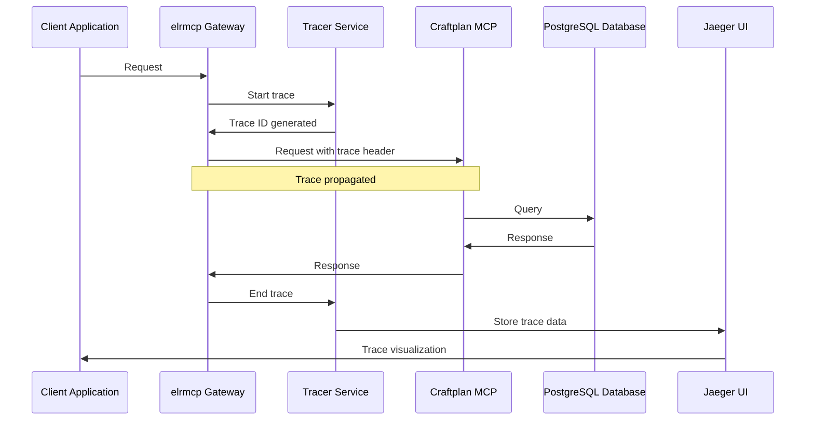

## 8. Configuration Management

### 8.1 Configuration Hierarchy

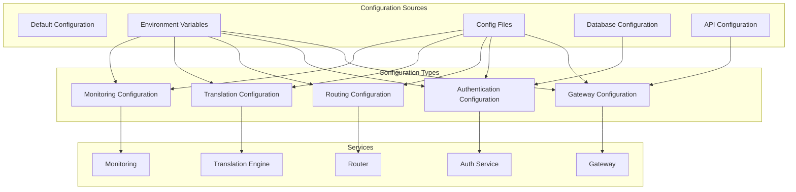

### 8.2 Configuration Management

```erlang
%% Configuration management
-record(config, {
    gateway :: map(),
    auth :: map(),
    routing :: map(),
    translation :: map(),
    monitoring :: map(),
    services :: map()
}).

%% Configuration loading
load_config() ->
    %% Load from multiple sources with precedence
    Defaults = load_default_config(),
    Env = load_env_config(),
    File = load_file_config(),
    Db = load_db_config(),

    %% Merge configurations
    Gateway = merge_configs([Defaults#gateway, Env#gateway, File#gateway, Db#gateway]),
    Auth = merge_configs([Defaults#auth, Env#auth, File#auth, Db#auth]),
    Routing = merge_configs([Defaults#routing, Env#routing, File#routing, Db#routing]),
    Translation = merge_configs([Defaults#translation, Env#translation, File#translation, Db#translation]),
    Monitoring = merge_configs([Defaults#monitoring, Env#monitoring, File#monitoring, Db#monitoring]),

    #config{
        gateway = Gateway,
        auth = Auth,
        routing = Routing,
        translation = Translation,
        monitoring = Monitoring,
        services = Services
    }.

%% Dynamic configuration update
update_config(Key, Value) ->
    Current = get_current_config(),
    Updated = update_config_value(Current, Key, Value),
    set_current_config(Updated),
    notify_config_changed(Key, Value).
```

## 9. Deployment and Scaling

### 9.1 Deployment Architecture

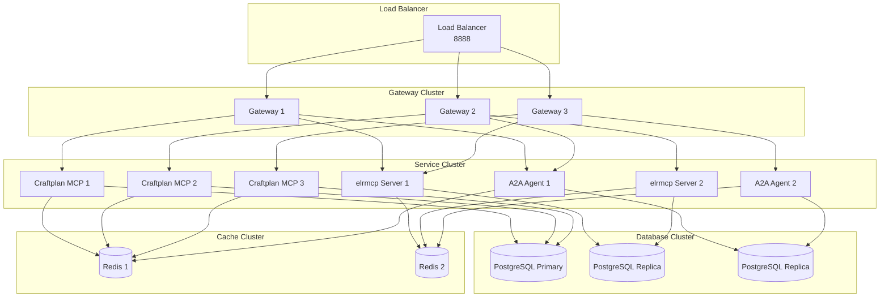

### 9.2 Auto-scaling Configuration

```yaml
# k8s/hpa.yaml
apiVersion: autoscaling/v2
kind: HorizontalPodAutoscaler
metadata:
  name: elrmcp-gateway-hpa
spec:
  scaleTargetRef:
    apiVersion: apps/v1
    kind: Deployment
    name: elrmcp-gateway
  minReplicas: 3
  maxReplicas: 10
  metrics:
  - type: Resource
    resource:
      name: cpu
      target:
        type: Utilization
        averageUtilization: 70
  - type: Resource
    resource:
      name: memory
      target:
        type: Utilization
        averageUtilization: 80
  behavior:
    scaleDown:
      stabilizationWindowSeconds: 300
      policies:
      - type: Percent
        value: 10
        periodSeconds: 60
    scaleUp:
      stabilizationWindowSeconds: 60
      policies:
      - type: Percent
        value: 50
        periodSeconds: 60
      - type: Pods
        value: 2
        periodSeconds: 60
```

### 9.3 Health Check and Self-healing

```ermaid
graph TB
    subgraph "Health Check System"
        HC[Health Checker]
        MON[Monitor]
        HEAL[Healing Service]
        ALERT[Alert Service]
    end

    subgraph "Services"
        GW[Gateway]
        CP[Craftplan MCP]
        ERP[elrmcp Server]
        A2A[A2A Agent]
    end

    subgraph "Health States"
        UP[Healthy]
        DOW[Degraded]
        OUT[Out of Service]
    end

    HC --> GW
    HC --> CP
    HC --> ERP
    HC --> A2A

    GW --> UP
    CP --> UP
    ERP --> DOW
    A2A --> OUT

    HC --> MON
    MON --> HEAL
    HEAL --> ALERT
```

## 10. Conclusion

This comprehensive component interaction design provides a detailed roadmap for implementing the Craftplan + elrmcp integration. The architecture ensures seamless communication between components while maintaining performance, security, and observability.

### 10.1 Key Features

1. **Unified Gateway**: Single entry point for all integrations
2. **Protocol Translation**: Automatic mapping between different MCP implementations
3. **Multi-agent Collaboration**: A2A protocol support for agent-to-agent workflows
4. **Real-time Updates**: SSE-based event streaming
5. **Comprehensive Error Handling**: Graceful degradation and recovery
6. **Performance Optimization**: Caching, batching, and load balancing
7. **Security**: Authentication, authorization, and data validation
8. **Observability**: Metrics, tracing, and logging
9. **Scalability**: Auto-scaling and load balancing
10. **Configurable**: Dynamic configuration management

### 10.2 Implementation Benefits

- **Reduced Complexity**: Single integration point
- **Improved Performance**: Optimized data flow and caching
- **Enhanced Reliability**: Error handling and recovery mechanisms
- **Better Security**: Comprehensive security controls
- **Increased Flexibility**: Dynamic configuration and scaling
- **Maintainability**: Clear separation of concerns
- **Observability**: Comprehensive monitoring and debugging

This component interaction design provides a solid foundation for building a robust, scalable, and maintainable integration platform that can evolve with changing business requirements.