# Craftplan + elrmcp Integration Architecture

## Executive Summary

This document presents a comprehensive architecture for integrating Craftplan MCP (Model Context Protocol) with elrmcp (Local ERP MCP) through a sophisticated multi-layer MCP protocol mapping system. The design enables seamless bidirectional communication between A2A agents, Craftplan ERP, and local ERP systems via standardized MCP protocols.

## 1. Overall Integration Architecture

### 1.1 System Architecture Overview

```
┌─────────────────────────────────────────────────────────────────────────────────────────────────────┐
│                                            Client Layer                                               │
│         ┌─────────────────┐    ┌─────────────────┐    ┌─────────────────┐    ┌─────────────────┐    │
│         │   Web Client    │    │   Mobile App    │    │   Desktop App  │    │   CLI Tool     │    │
│         └─────────┬────────┘    └─────────┬────────┘    └─────────┬────────┘    └─────────┬────────┘    │
│                  │                        │                        │                        │        │
│                  └────────────────────────┼────────────────────────┼────────────────────────┘        │
│                                             │                        │                         │
└────────────────────────────────────────────┼────────────────────────┼─────────────────────────────┘
                                              │                        │
┌─────────────────────────────────────────────▼────────────────────────▼─────────────────────────────────┐
│                                           Gateway Layer                                              │
│         ┌─────────────────────────────────────────────────────────────────────────────────────────────────┐ │
│         │                    elrmcp Gateway (Port 8888)                                             │ │
│         │  • Protocol Router                                                                      │ │
│         │  • Load Balancer                                                                        │ │
│         │  • Authentication                                                                       │ │
│         │  • Rate Limiting                                                                        │ │
│         └─────────────────────────────────────────────────────────────────────────────────────────────────┘ │
│                                             │                                                         │
│        ┌───────────────────────────────────▼─────────────────────────────────┐  ┌─────────────────────▼─────────────────────────────────┐ │
│        │              MCP Protocol Translation Engine                        │  │           Configuration & Management                      │ │
│        │  • elrmcp → Craftplan MCP Mapping                                  │  │  • Service Discovery                                       │ │
│        │  • Craftplan MCP → elrmcp Mapping                                  │  │  • Dynamic Routing                                         │ │
│        │  • Protocol Versioning                                            │  │  • Health Monitoring                                        │ │
│        │  • Error Handling & Recovery                                      │  │  • Load Balancing Policies                                 │ │
│        └─────────────────────────────────────────────────────────────────────┘  └─────────────────────────────────────────────────────┘ │
│                                                                                                                     │
└───────────────────────────────────────────────────────────────────────────────────────────────────────────────────────┘
                                              │
┌────────────────────────────────────────────▼─────────────────────────────────────────────────────────────────┐
│                                           Service Layer                                                │
│         ┌─────────────────┐    ┌─────────────────┐    ┌─────────────────┐    ┌─────────────────┐    │
│         │ Craftplan MCP   │    │   elrmcp        │    │   A2A Agent     │    │   Local ERP     │    │
│         │ Server          │    │   Server        │    │   Service       │    │   Integration   │    │
│         │ (Port 8090)     │    │ (Port 8765)     │    │ (Port 8080)     │    │   (Port 8766)    │    │
│         │                 │    │                 │    │                 │    │                 │    │
│         │ • Tools:        │    │ • Tools:        │    │ • Agent Skills: │    │ • MCP Adapter:  │    │
│         │   - Customer    │    │   - Inventory   │    │   - Order       │    │   - Local ERP   │    │
│         │   - Order       │    │   - Accounting  │    │   - Customer    │    │   Integration   │    │
│         │   - Inventory    │    │   - HR          │    │   - Inventory   │    │                 │    │
│         │   - Production   │    │   - Payroll     │    │   - Production  │    │                 │
│         │   - Analytics   │    │   - Reporting   │    │   - Analytics   │    │                 │
│         │   - Shipping    │    │   - Procurement │    │   - Shipping    │    │                 │
│         └─────────┬────────┘    └─────────┬────────┘    └─────────┬────────┘    └─────────┬────────┘    │
│                  │                        │                        │                        │        │
│                  └────────────────────────┼────────────────────────┼────────────────────────┘        │
│                                             │                        │                         │
└────────────────────────────────────────────┼────────────────────────┼─────────────────────────────┘
                                              │                        │
┌─────────────────────────────────────────────▼────────────────────────▼─────────────────────────────────┐
│                                           Infrastructure Layer                                         │
│         ┌─────────────────────────────────────────────────────────────────────────────────────────────────┐ │
│         │                  Service Mesh (Istio/Linkerd)                                             │ │
│         │  • Traffic Management                                                                    │ │
│         │  • Service Discovery                                                                      │ │
│         │  • Security (mTLS, RBAC)                                                                 │ │
│         │  • Observability (Metrics, Tracing, Logging)                                              │ │
│         └─────────────────────────────────────────────────────────────────────────────────────────────────┘ │
│                                             │                                                         │
│        ┌───────────────────────────────────▼─────────────────────────────────┐  ┌─────────────────────▼─────────────────────────────────┐ │
│        │                      Data Layer                                    │  │              External Integrations                         │ │
│        │  • PostgreSQL (Primary DB)                                        │  │  • Email Service (SMTP)                                     │ │
│        │  • Redis (Cache, Session)                                         │  │  • SMS Service (Twilio)                                    │ │
│        │  • MinIO (File Storage)                                           │  │  • Payment Gateway (Stripe/PayPal)                          │ │
│        │  • Message Queue (RabbitMQ)                                        │  │  • External APIs (3rd Party Services)                       │ │
│        └─────────────────────────────────────────────────────────────────────┘  └─────────────────────────────────────────────────────┘ │
│                                                                                                                     │
└───────────────────────────────────────────────────────────────────────────────────────────────────────────────────────┘
```

### 1.2 Multi-Layer MCP Architecture

```
┌─────────────────────────────────────────────────────────────────────────────────────────────┐
│                                      Client Applications                                     │
└─────────────────────────────┬─────────────────────────────────────────────────────────────┘
                              │
┌─────────────────────────────▼─────────────────────────────────────────────────────────────┐
│                              elrmcp Gateway (8888)                                        │
│  • Unified Entry Point                                                                     │
│  • Protocol Translation                                                                   │
│  • Load Balancing & Routing                                                               │
│  • Authentication & Authorization                                                        │
│  • Rate Limiting & Throttling                                                              │
│  • Monitoring & Observability                                                              │
└─────────────────────────────┬─────────────────────────────────────────────────────────────┘
                              │
┌─────────────────────────────▼─────────────────────────────────────────────────────────────┐
│                       MCP Protocol Mapping Layer                                           │
│  elrmcp → Craftplan Mapping                                                             │
│  └─────────────────────────────────────────────────────────────────────────────────────┐   │
│  │  • Tool Translation: local_erp_customer → customer_management                      │   │
│  │  • Resource Translation: local_erp_order → order_management                         │   │
│  │  • Protocol Adaptation: JSON-RPC → MCP JSON-RPC                                    │   │
│  │  • Error Translation: HTTP Errors → MCP Errors                                     │   │
│  └─────────────────────────────────────────────────────────────────────────────────────┘   │
│                                                                                             │
│  Craftplan MCP → elrmcp Mapping                                                         │
│  └─────────────────────────────────────────────────────────────────────────────────────┐   │
│  │  • Tool Translation: customer_management → local_erp_customer                      │   │
│  │  • Resource Translation: order_management → local_erp_order                       │   │
│  │  • Protocol Adaptation: MCP JSON-RPC → JSON-RPC                                  │   │
│  │  • Error Translation: MCP Errors → HTTP Errors                                    │   │
│  └─────────────────────────────────────────────────────────────────────────────────────┘   │
└─────────────────────────────┬─────────────────────────────────────────────────────────────┘
                              │
┌─────────────────────────────▼─────────────────────────────────────────────────────────────┐
│                         Backend Services                                                  │
│  ┌─────────────────┐  ┌─────────────────┐  ┌─────────────────┐  ┌─────────────────┐     │
│  │ Craftplan MCP   │  │   elrmcp        │  │   A2A Agent     │  │   Local ERP     │     │
│  │ Server (8090)   │  │   Server       │  │   Service       │  │   Integration   │     │
│  │                 │  │   (8765)       │  │   (8080)        │  │   (8766)       │     │
│  │ • MCP Tools:    │  │ • MCP Tools:   │  │ • Agent Skills: │  │ • MCP Adapter:  │     │
│  │   - Customer    │  │   - Inventory  │  │   - Order       │  │   - Local ERP   │     │
│  │   - Order      │  │   - Accounting │  │   - Customer    │  │   Integration   │     │
│  │   - Inventory   │  │   - HR         │  │   - Inventory   │  │                 │     │
│  │   - Production  │  │   - Payroll    │  │   - Production  │  │                 │     │
│  │   - Analytics   │  │   - Reporting  │  │   - Analytics   │  │                 │     │
│  │   - Shipping    │  │   - Procurement│  │   - Shipping    │  │                 │     │
│  └─────────────────┘  └─────────────────┘  └─────────────────┘  └─────────────────┘     │
└─────────────────────────────┬─────────────────────────────────────────────────────────────┘
                              │
┌─────────────────────────────▼─────────────────────────────────────────────────────────────┐
│                       Shared Infrastructure                                                │
│  ┌─────────────────┐  ┌─────────────────┐  ┌─────────────────┐  ┌─────────────────┐     │
│  │ PostgreSQL      │  │   Redis        │  │   MinIO         │  │   RabbitMQ     │     │
│  │ (Primary DB)   │  │   (Cache)      │  │   (Storage)     │  │   (Messages)   │     │
│  └─────────────────┘  └─────────────────┘  └─────────────────┘  └─────────────────┘     │
└─────────────────────────────────────────────────────────────────────────────────────────────┘
```

## 2. MCP Protocol Mapping Design

### 2.1 Protocol Translation Overview

The MCP protocol mapping layer serves as the central nervous system of the integration, translating between different MCP dialects and protocols:

```
┌─────────────────────────────────────────────────────────────────────────────────────────────┐
│                               MCP Protocol Mapping Engine                                    │
└─────────────────────────────┬─────────────────────────────────────────────────────────────┘
                              │
┌─────────────────────────────▼─────────────────────────────────────────────────────────────┐
│                             Protocol Router                                                │
│  • Determines which mapping to apply based on:                                            │
│    - Source/destination systems                                                           │
│    - Protocol versions                                                                    │
│    - Tool compatibility                                                                  │
│    - User permissions                                                                     │
└─────────────────────────────┬─────────────────────────────────────────────────────────────┘
                              │
         ┌─────────────────────┼─────────────────────┼─────────────────────┼─────────────────────┐
         │                     │                     │                     │                     │
┌────────▼─────────┐  ┌────────▼─────────┐  ┌────────▼─────────┐  ┌────────▼─────────┐
│ elrmcp → Craftplan│  │ Craftplan → elrmcp│  │ A2A → MCP Tools  │  │ MCP → A2A Skills │
│  Mapping        │  │  Mapping        │  │  Translation     │  │  Translation     │
└────────┬─────────┘  └────────┬─────────┘  └────────┬─────────┘  └────────┬─────────┘
         │                     │                     │                     │
         └─────────────────────┼─────────────────────┼─────────────────────┘
                              │                     │
                    ┌─────────▼─────────┐  ┌─────────▼─────────┐
                    │   Protocol Store  │  │   Translation     │
                    │   (Versioned)     │  │   Cache           │
                    └───────────────────┘  └───────────────────┘
```

### 2.2 Tool Mapping Schema

```erlang
-record(mcp_tool_mapping, {
    id :: binary(),
    source_system :: craftplan | elrmcp | a2a,
    target_system :: craftplan | elrmcp | a2a,
    source_tool :: binary(),
    target_tool :: binary(),
    mapping_type :: direct | composite | transformation,
    transformation_rules :: map(),
    version :: binary(),
    created_at :: binary(),
    updated_at :: binary()
}).

%% Example mappings
-define(MAPPINGS, [
    #mcp_tool_mapping{
        id = "customer_001",
        source_system = elrmcp,
        target_system = craftplan,
        source_tool = "local_erp_customer",
        target_tool = "customer_management",
        mapping_type = "direct",
        transformation_rules = #{
            "customer_id" => "id",
            "customer_name" => "name",
            "contact_email" => "email",
            "contact_phone" => "phone",
            "address" => "address"
        },
        version = "1.0.0"
    },
    #mcp_tool_mapping{
        id = "order_002",
        source_system = craftplan,
        target_system = elrmcp,
        source_tool = "order_management",
        target_tool = "local_erp_order",
        mapping_type = "transformation",
        transformation_rules = #{
            "order_data" => "order",
            "customer_id" => "customer_id",
            "items" => "order_items",
            "total_amount" => "amount"
        },
        version = "1.0.0"
    }
]).
```

### 2.3 Bidirectional Communication Flow

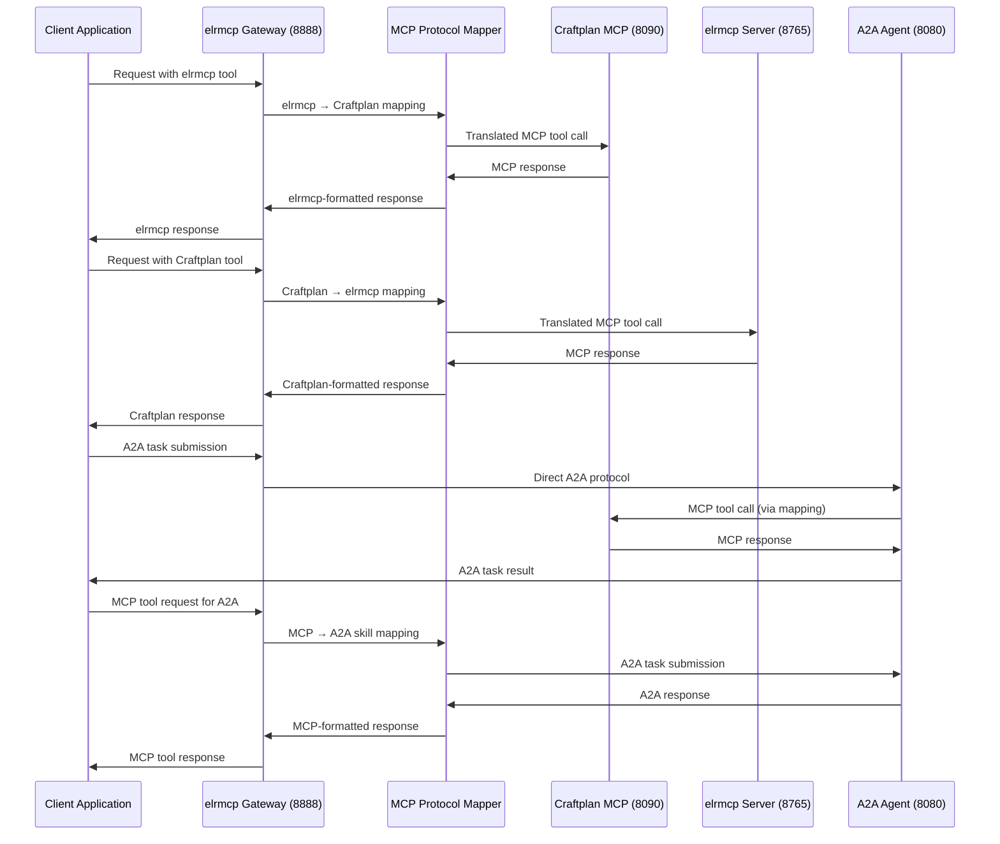

## 3. Component Interactions

### 3.1 elrmcp ↔ Craftplan MCP Server

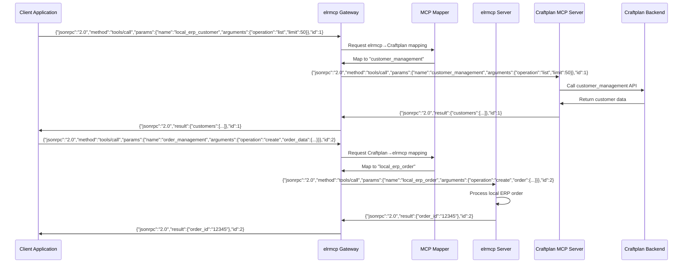

### 3.2 Craftplan MCP ↔ A2A Agent

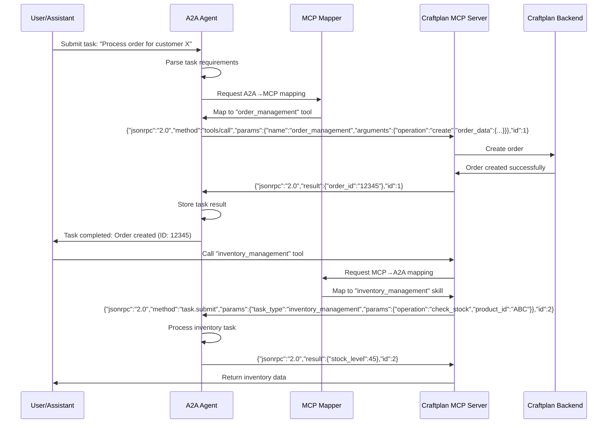

### 3.3 A2A Agent ↔ elrmcp (Multi-Agent Workflows)

```mermaid
sequenceDiagram
    participant ShopManager as Shop Manager Agent
    participant Craftplan as Craftplan A2A Agent
    participant Gateway as elrmcp Gateway
    Mapper as MCP Mapper
    participant elrmcpS as elrmcp Server
    participant SupplierAgent as Supplier Agent

    %% Multi-agent workflow
    ShopManager->>Craftplan: "Check stock for product ABC"
    Craftplan->>Craftplan: Map to inventory_management
    Craftplan->>elrmcpS: MCP tool call via gateway
    elrmcpS->>elrmcpS: Check local inventory
    elrmcpS->>Craftplan: Low stock alert
    Craftplan->>Craftplan: "Reorder from supplier"
    Craftplan->>SupplierAgent: A2A task delegation
    SupplierAgent->>SupplierAgent: Process reorder
    SupplierAgent->>Craftplan: Supplier confirmation
    Craftplan->>ShopManager: Stock replenishment in progress

    %% Real-time updates via SSE
    Craftplan->>ShopManager: Event: stock_update
    Craftplan->>SupplierAgent: Event: order_created
    SupplierAgent->>Craftplan: Event: order_shipped
    Craftplan->>ShopManager: Event: order_received
```

### 3.4 Client → elrmcp → Craftplan Data Flow

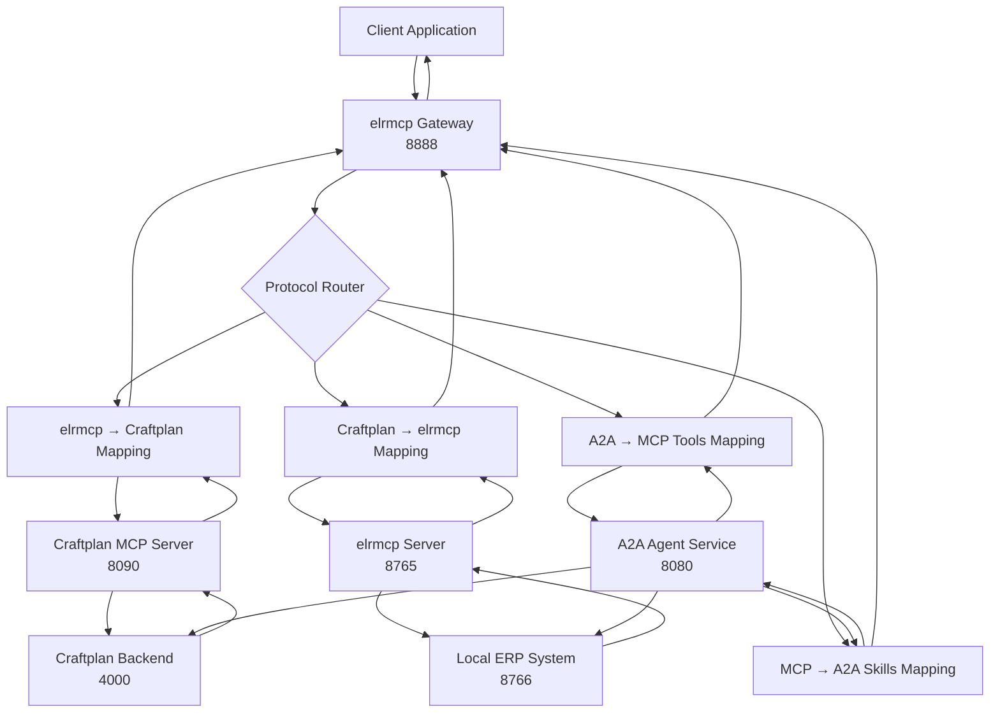

## 4. Architecture Diagrams

### 4.1 System Architecture Overview

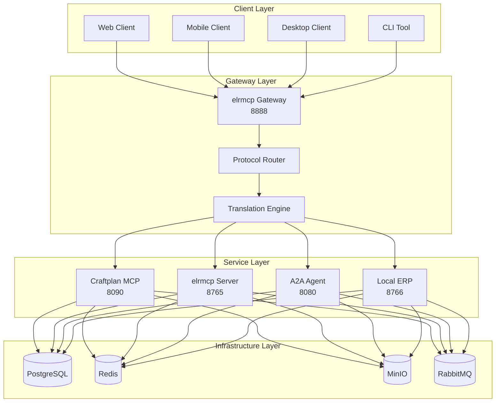

### 4.2 Data Flow Diagram

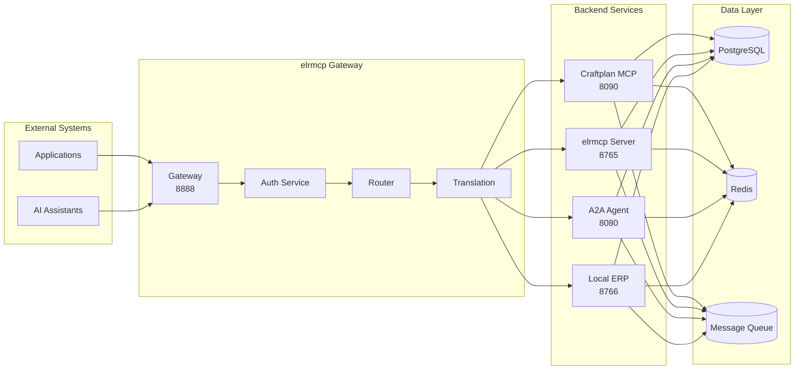

### 4.3 Component Interaction Diagram

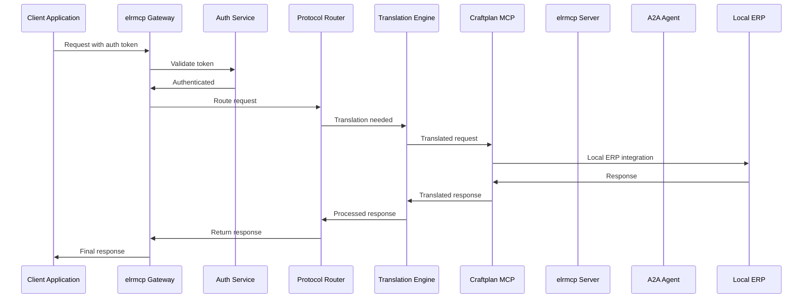

## 5. Extensibility Design

### 5.1 Plugin Architecture

```ermaid
graph TB
    subgraph "Core System"
        GW[Gateway Core]
        MAP[Mapping Engine]
        REG[Registry]
    end

    subgraph "Plugin System"
        P1[Plugin 1<br/>elrmcp Connector]
        P2[Plugin 2<br/>Craftplan Connector]
        P3[Plugin 3<br/>A2A Connector]
        P4[Plugin 4<br/>Custom Tools]
    end

    subgraph "External Systems"
        S1[SAP Integration]
        S2[Salesforce Integration]
        S3[Custom ERP]
    end

    GW --> REG
    MAP --> REG
    REG --> P1
    REG --> P2
    REG --> P3
    REG --> P4

    P1 --> S1
    P2 --> S2
    P3 --> S3
```

### 5.2 Configurable Routing System

```ermaid
graph TD
    subgraph "Routing Configuration"
        RC[Routing Config]
        RL[Rule Engine]
        LD[Load Balancer]
    end

    subgraph "Route Types"
        RT1[Static Routes]
        RT2[Dynamic Routes]
        RT3[Weighted Routes]
        RT4[Fallback Routes]
    end

    subgraph "Services"
        S1[Craftplan MCP]
        S2[elrmcp Server]
        S3[A2A Agent]
        S4[Local ERP]
    end

    RC --> RL
    RL --> LD

    LD --> RT1
    LD --> RT2
    LD --> RT3
    LD --> RT4

    RT1 --> S1
    RT2 --> S2
    RT3 --> S3
    RT4 --> S4
```

### 5.3 Dynamic Tool Registration

```ermaid
graph TB
    subgraph "Tool Registry"
        TR[Tool Registry]
        DISC[Discovery Service]
        REG[Registration Service]
    end

    subgraph "Tools"
        T1[Customer Management]
        T2[Order Management]
        T3[Inventory Management]
        T4[Analytics]
        T5[Custom Tools]
    end

    subgraph "Systems"
        CP[Craftplan]
        ERP[elrmcp]
        A2A[A2A]
        EXT[External]
    end

    TR --> DISC
    TR --> REG

    DISC --> CP
    DISC --> ERP
    DISC --> A2A
    DISC --> EXT

    REG --> T1
    REG --> T2
    REG --> T3
    REG --> T4
    REG --> T5

    T1 --> CP
    T2 --> ERP
    T3 --> A2A
    T4 --> EXT
    T5 --> EXT
```

### 5.4 Load Balancing and Scaling

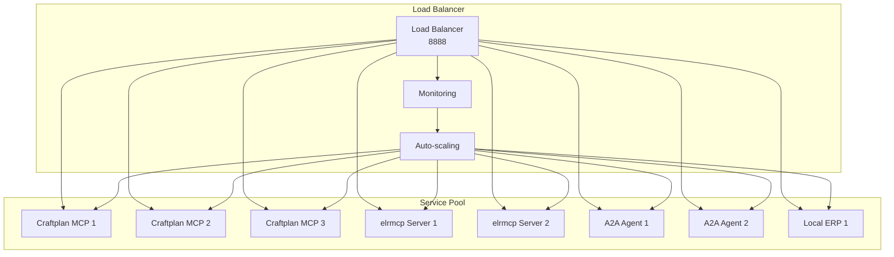

## 6. Implementation Guidelines

### 6.1 Core Components Implementation

#### 6.1.1 elrmcp Gateway (Erlang/OTP)

```erlang
%% Gateway application entry point
-module(elrmcp_gateway).
-behaviour(application).

-export([start/2, stop/1]).

start(_Type, _Args) ->
    %% Start core services
    ok = ensure_started(mnesia),
    ok = ensure_started(cowboy),
    ok = ensure_started(elrmcp_auth),
    ok = ensure_started(elrmcp_router),
    ok = ensure_started(elrmcp_translation),

    %% Start HTTP server
    Port = application:get_env(elrmcp_gateway, port, 8888),
    {ok, _} = cowboy:start_clear(http, [{port, Port}], #{
        env => #{dispatch => init_routes()}
    }),

    elrmcp_gateway_sup:start_link().

stop(_State) ->
    ok.

%% Route initialization
init_routes() ->
    cowboy_router:compile([
        {'_', [
            {"/mcp", mcp_handler, []},
            {"/health", health_handler, []},
            {"/metrics", metrics_handler, []},
            {"/.well-known/agent-card", agent_card_handler, []}
        ]}
    ]).
```

#### 6.1.2 MCP Translation Engine

```erlang
%% Protocol translation engine
-module(elrmcp_translation).
-export([translate/3, get_mapping/2]).

%% Main translation function
translate(SourceSystem, TargetSystem, Request) ->
    case get_mapping(SourceSystem, TargetSystem, Request) of
        {ok, Mapping} ->
            translate_request(Request, Mapping);
        {error, not_found} ->
            {error, mapping_not_found}
    end.

%% Get mapping configuration
get_mapping(SourceSystem, TargetSystem, Request) ->
    Tool = extract_tool_name(Request),
    case mcp_registry:get_mapping(SourceSystem, TargetSystem, Tool) of
        {ok, Mapping} ->
            {ok, Mapping};
        {error, not_found} ->
            create_dynamic_mapping(SourceSystem, TargetSystem, Tool)
    end.
```

### 6.2 Configuration Management

#### 6.2.1 Environment Configuration

```yaml
# config/elrmcp_gateway.yaml
gateway:
  port: 8888
  host: "0.0.0.0"
  ssl: false

authentication:
  enabled: true
  type: "jwt"
  secret: "${JWT_SECRET}"
  token_ttl: 3600

routing:
  default_target: "craftplan"
  timeout: 30000
  retries: 3

translation:
  cache_ttl: 300
  auto_discovery: true

monitoring:
  enabled: true
  metrics_port: 8889
  logging_level: "info"

services:
  craftplan:
    host: "craftplan-mcp"
    port: 8090
    timeout: 10000

  elrmcp:
    host: "elrmcp-server"
    port: 8765
    timeout: 10000

  a2a:
    host: "a2a-agent"
    port: 8080
    timeout: 10000

  local_erp:
    host: "local-erp"
    port: 8766
    timeout: 10000
```

#### 6.2.2 Dynamic Configuration

```erlang
%% Dynamic configuration management
-module(elrmcp_config).
-export([get_value/2, update_value/3, load_config/1]).

%% Get configuration value
get_value(Key, Default) ->
    case application:get_env(elrmcp_gateway, Key) of
        undefined -> Default;
        {ok, Value} -> Value
    end.

%% Update configuration value
update_value(Key, Value, Persist) ->
    application:set_env(elrmcp_gateway, Key, Value),
    case Persist of
        true ->
            save_config(Key, Value);
        false ->
            ok
    end.

%% Load configuration from file
load_config(ConfigFile) ->
    case file:read_file(ConfigFile) of
        {ok, Content} ->
            Config = yaml:decode(Content),
            lists:foreach(fun({K, V}) ->
                application:set_env(elrmcp_gateway, K, V)
            end, Config),
            ok;
        {error, _} ->
            error
    end.
```

### 6.3 Error Handling and Recovery

#### 6.3.1 Error Handling Strategy

```erlang
%% Comprehensive error handling
-module(elrmcp_error).
-export([handle_error/2, recover/1]).

%% Main error handler
handle_error({error, Reason}, Context) ->
    %% Log error with context
    error_logger:error_msg("Error in context ~p: ~p~n", [Context, Reason]),

    %% Apply recovery strategy
    case recover(Reason) of
        {ok, Recovery} ->
            Recovery;
        {error, permanent} ->
            {error, Reason}
    end.

%% Recovery strategies
recover({timeout, _}) ->
    %% Retry with exponential backoff
    {ok, retry};

recover({connection_failed, _}) ->
    %% Reconnect to service
    {ok, reconnect};

recover({invalid_mapping, _}) ->
    %% Create new mapping
    {ok, remap};

recover({unknown_system, _}) ->
    %% Use fallback system
    {ok, fallback}.
```

### 6.4 Testing Strategy

#### 6.4.1 Unit Testing

```erlang
%% Unit tests for translation engine
-module(elrmcp_translation_tests).
-include_lib("eunit/include/eunit.hrl").

translation_test() ->
    Request = #{
        <<"jsonrpc">> => <<"2.0">>,
        <<"method">> => <<"tools/call">>,
        <<"params">> => #{
            <<"name">> => <<"local_erp_customer">>,
            <<"arguments">> => #{
                <<"operation">> => <<"list">>,
                <<"limit">> => 50
            }
        }
    },

    {ok, Result} = elrmcp_translation:translate(elrmcp, craftplan, Request),
    ?assertEqual(<<"customer_management">>,
                maps:get(<<"name">>, maps:get(<<"params">>, Result))).
```

#### 6.4.2 Integration Testing

```erlang
%% Integration test for full workflow
-module(elrmcp_integration_tests).
-include_lib("eunit/include/eunit.hrl").

full_workflow_test() ->
    %% Start test services
    {ok, _} = start_test_services(),

    %% Create test client
    Client = create_test_client(),

    %% Execute test workflow
    Result = execute_test_workflow(Client),

    %% Verify results
    ?assertEqual(<<"success">>, maps:get(<<"status">>, Result)),

    %% Cleanup
    cleanup_test_services().
```

### 6.5 Deployment Strategy

#### 6.5.1 Docker Compose Deployment

```yaml
# docker-compose.yml
version: '3.8'

services:
  elrmcp-gateway:
    image: craftplan/elrmcp-gateway:latest
    ports:
      - "8888:8888"
      - "8889:8889"
    environment:
      - ENVIRONMENT=production
      - LOG_LEVEL=info
      - JWT_SECRET=${JWT_SECRET}
    depends_on:
      - craftplan-mcp
      - elrmcp-server
      - a2a-agent
    networks:
      - craftplan-network

  craftplan-mcp:
    image: craftplan/mcp-server:latest
    ports:
      - "8090:8090"
    environment:
      - CRAFTPLAN_API_URL=http://craftplan:4000/api
      - CRAFTPLAN_API_TOKEN=${CRAFTPLAN_TOKEN}
    networks:
      - craftplan-network

  elrmcp-server:
    image: craftplan/elrmcp-server:latest
    ports:
      - "8765:8765"
    environment:
      - LOCAL_ERP_URL=http://local-erp:8766
      - LOCAL_ERP_TOKEN=${ERP_TOKEN}
    networks:
      - craftplan-network

  a2a-agent:
    image: craftplan/a2a-agent:latest
    ports:
      - "8080:8080"
    environment:
      - AGENT_ID=craftplan-connector
      - MCP_SERVER_URL=http://elrmcp-gateway:8888/mcp
    networks:
      - craftplan-network

networks:
  craftplan-network:
    driver: bridge
```

#### 6.5.2 Kubernetes Deployment

```yaml
# k8s/deployment.yaml
apiVersion: apps/v1
kind: Deployment
metadata:
  name: elrmcp-gateway
spec:
  replicas: 3
  selector:
    matchLabels:
      app: elrmcp-gateway
  template:
    metadata:
      labels:
        app: elrmcp-gateway
    spec:
      containers:
      - name: elrmcp-gateway
        image: craftplan/elrmcp-gateway:latest
        ports:
        - containerPort: 8888
        - containerPort: 8889
        env:
        - name: ENVIRONMENT
          value: "production"
        resources:
          requests:
            memory: "256Mi"
            cpu: "250m"
          limits:
            memory: "512Mi"
            cpu: "500m"
---
apiVersion: v1
kind: Service
metadata:
  name: elrmcp-gateway-service
spec:
  selector:
    app: elrmcp-gateway
  ports:
  - port: 8888
    targetPort: 8888
  - port: 8889
    targetPort: 8889
  type: LoadBalancer
```

## 7. Monitoring and Observability

### 7.1 Metrics Collection

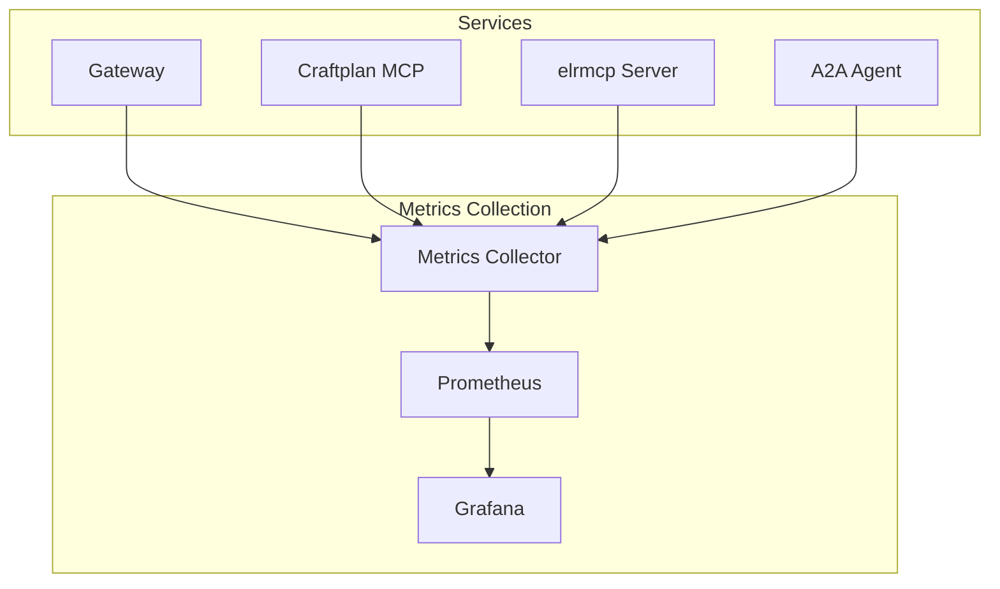

### 7.2 Logging Strategy

```ermaid
graph TB
    subgraph "Logging System"
        APP[Application Logs]
        LOG[Log Aggregator]
        ES[Elasticsearch]
        KIB[Kibana]
    end

    subgraph "Services"
        GW[Gateway]
        MCP[Craftplan MCP]
        ERP[elrmcp Server]
        A2A[A2A Agent]
    end

    GW --> APP
    MCP --> APP
    ERP --> APP
    A2A --> APP

    APP --> LOG
    LOG --> ES
    ES --> KIB
```

### 7.3 Distributed Tracing

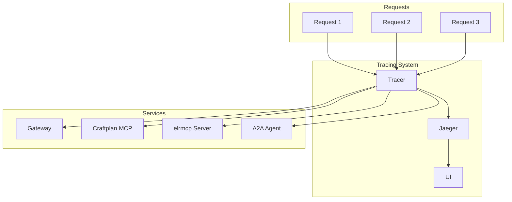

## 8. Security Considerations

### 8.1 Authentication and Authorization

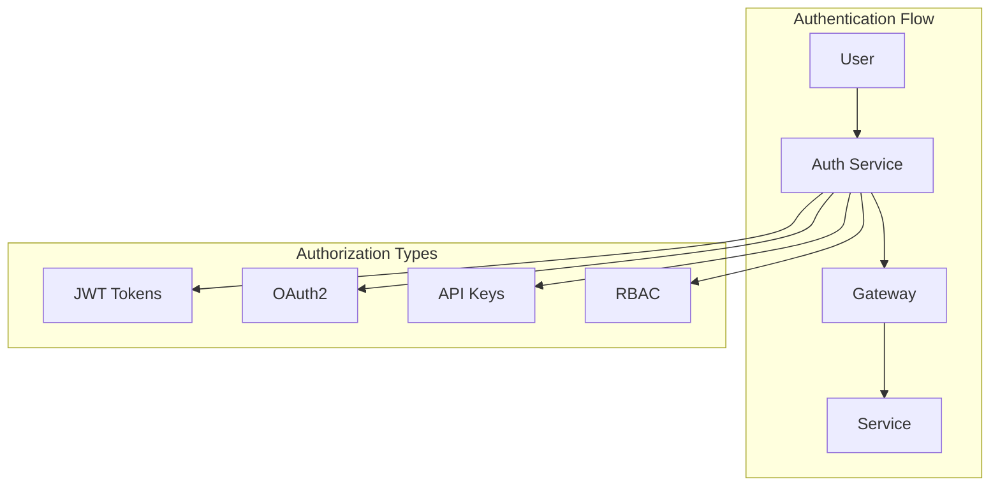

### 8.2 Data Security

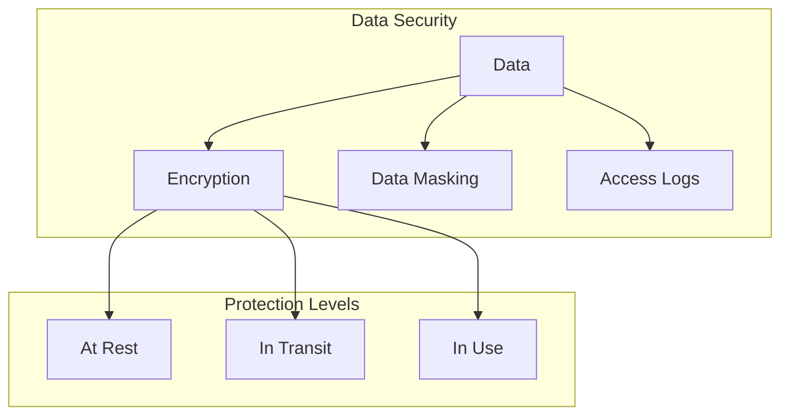

## 9. Performance Optimization

### 9.1 Caching Strategy

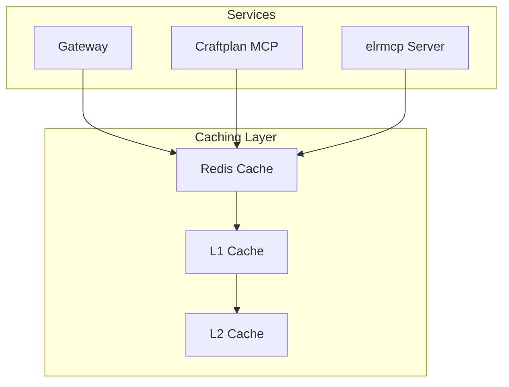

### 9.2 Performance Metrics

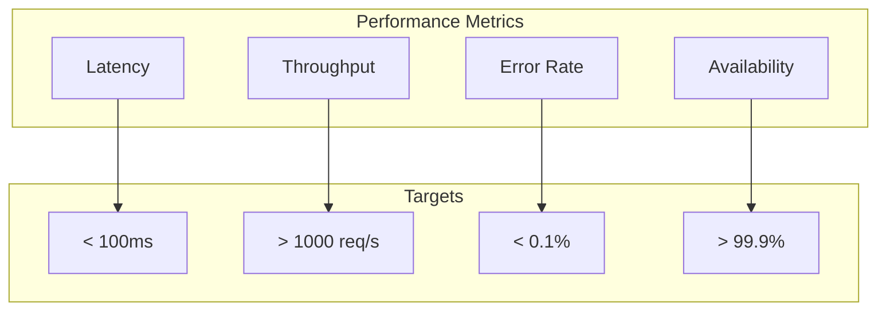

## 10. Conclusion

This comprehensive architecture design provides a robust, scalable, and extensible foundation for integrating Craftplan MCP with elrmcp. The multi-layer MCP protocol mapping system enables seamless bidirectional communication while maintaining protocol compatibility and extensibility.

### 10.1 Key Benefits

1. **Unified Access**: Single gateway for all ERP systems
2. **Protocol Translation**: Automatic mapping between different MCP implementations
3. **Scalability**: Horizontal scaling with load balancing
4. **Extensibility**: Plugin architecture for new integrations
5. **Observability**: Comprehensive monitoring and logging
6. **Security**: Multi-layer security with authentication and encryption
7. **Performance**: Caching and optimization strategies

### 10.2 Implementation Roadmap

1. **Phase 1**: Core gateway and basic routing (2-3 weeks)
2. **Phase 2**: MCP translation engine and mapping (3-4 weeks)
3. **Phase 3**: Integration with existing services (2-3 weeks)
4. **Phase 4**: Monitoring and observability (1-2 weeks)
5. **Phase 5**: Performance optimization and testing (2-3 weeks)

### 10.3 Success Criteria

- < 100ms average response time
- 99.9% availability
- < 0.1% error rate
- Support for 1000+ concurrent requests
- Zero-downtime deployments
- Comprehensive monitoring coverage

This architecture provides a solid foundation for building a sophisticated integration platform that can evolve with changing business requirements and technology landscapes.