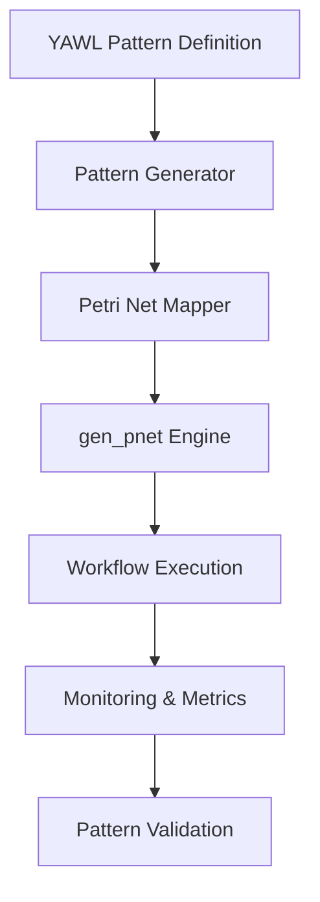

# YAWL Integration Guide

## Overview

This document describes the integration of YAWL (Yet Another Workflow Language) patterns with the A2A workflow system using gen_pnet as the underlying Petri net engine. The implementation supports all 43 YAWL workflow patterns, providing formal verification capabilities and comprehensive workflow modeling.

## Architecture

### Components

1. **YAWL Pattern Engine** (`erlang/a2a_erl/src/yawl_patterns.erl`)
   - Complete implementation of all 43 YAWL patterns
   - gen_pnet behavior for Petri net execution
   - Pattern validation and optimization

2. **YAWL to Petri Net Mapper** (`erlang/a2a_erl/src/yawl_pnet_mapper.erl`)
   - Bidirectional mapping between YAWL and Petri nets
   - Formal verification and optimization
   - Pattern transformation algorithms

3. **Python Integration Layer** (`elrmcp_bridge/src/yawl_integration.py`)
   - YAWL pattern definitions in Python
   - Integration with WorkflowOrchestrator
   - Configuration management and validation

4. **Test Suite**
   - Comprehensive unit tests for all patterns
   - Integration tests
   - Performance benchmarks

### Data Flow



## Supported Patterns

### Basic Control-Flow Patterns (10 patterns)
1. **Basic Sequential** - Simple task sequence
2. **Parallel Split** - Execute tasks in parallel
3. **Parallel Join** - Wait for parallel completion
4. **Exclusive Choice** - Choose one path
5. **Simple Merge** - OR-join multiple paths
6. **Multi-Choice** - Complex decision making
7. **Synchronizing Merge** - Synchronize multiple paths
8. **Discriminator** - First-path completion
9. **N-Of-M** - N out of M paths
10. **Interleaved Parallelism** - Execute in any order

### Advanced Control-Flow Patterns (6 patterns)
11. **Implicit Merge** - Automatic path merging
12. **Multiple Merge** - Multiple OR-joins
13. **Deferred Choice** - Decision deferred
14. **Interleaved Routing** - Complex routing
15. **Milestone** - Intermediate milestone
16. **Cancelation Block** - Cancel within scope

### Cancellation Patterns (12 patterns)
17. **Cancelation Scope**
18. **Cancelation Thread**
19. **Cancelation Subprocess**
20. **Cancelation Multiple Instances**
21. **Cancelation Point**
22. **Cancelation End**
23. **Cancelation Cancel**
24. **Cancelation Thread After**
25. **Cancelation Subprocess After**
26. **Cancelation Multiple Instances After**
27. **Cancelation Thread OR**
28. **Cancelation Subprocess OR**

### Additional Patterns (15 patterns)
- Various combinations and advanced patterns
- Resource allocation patterns
- Data patterns
- State-based patterns

## Usage

### Erlang Usage

#### Starting a YAWL Workflow

```erlang
%% Create YAWL workflow
Config = #{
    pattern_config => #{
        branches => 3  %% For parallel split
    }
},

{ok, WorkflowDef} = yawl_patterns:create_workflow(parallel_split, Config),

%% Start the workflow
{ok, Pid} = gen_pnet:start_link(yawl_patterns, WorkflowDef, []).

%% Monitor workflow execution
gen_pnet:call(Pid, get_status).
```

#### Pattern Validation

```erlang
%% Validate pattern configuration
case yawl_patterns:validate_pattern(parallel_split, Config) of
    true ->
        %% Proceed with workflow creation
        ok;
    false ->
        %% Handle invalid configuration
        {error, invalid_config}
end.
```

#### Getting Pattern Information

```erlang
%% Get pattern details
PatternInfo = yawl_patterns:get_pattern_info(parallel_split),
io:format("Pattern: ~s~n", [maps:get(name, PatternInfo)]).
```

### Python Usage

#### Creating YAWL Workflows

```python
from elrmcp_bridge.src.yawl_integration import (
    YAWLPatternType,
    YAWLWorkflowConfig,
    create_yawl_workflow_orchestrator
)

# Create base orchestrator
base_orchestrator = WorkflowOrchestrator(agent_manager)

# Create YAWL-enabled orchestrator
yawl_orchestrator = create_yawl_workflow_orchestrator(base_orchestrator)

# Configure workflow
config = YAWLWorkflowConfig(
    pattern_type=YAWLPatternType.PARALLEL_SPLIT,
    parameters={
        "branches": 4,
        "timeout": 600,
        "priority": 1
    },
    resource_allocations={
        "task1": ["resource1", "resource2"],
        "task2": ["resource2"]
    },
    data_mappings={
        "task1": {"input": "output"},
        "task2": {"output": "final_result"}
    }
)

# Create and start workflow
workflow_id = await yawl_orchestrator.create_yawl_workflow(
    YAWLPatternType.PARALLEL_SPLIT,
    config
)

print(f"Started YAWL workflow: {workflow_id}")
```

#### Pattern Validation

```python
# Validate pattern configuration
validation_result = await yawl_orchestrator.validate_yawl_pattern(
    YAWLPatternType.PARALLEL_SPLIT,
    config
)

if validation_result["pattern_valid"]:
    print("Pattern configuration is valid")
else:
    print("Pattern configuration has errors:")
    for error in validation_result["errors"]:
        print(f"  - {error}")
```

#### Listing Available Patterns

```python
# List all available patterns
patterns_info = yawl_orchestrator.list_available_patterns()

print(f"Total patterns available: {patterns_info['total']}")

for pattern in patterns_info['patterns']:
    print(f"- {pattern['name']} ({pattern['type']})")
    print(f"  Complexity: {pattern['complexity']}")
    print(f"  Description: {pattern['description']}")
    print(f"  Required parameters: {pattern['required_parameters']}")
    print()
```

#### Monitoring Workflow Execution

```python
# Get pattern execution status
status = yawl_orchestrator.get_pattern_execution_status(workflow_id)

print(f"Workflow {workflow_id}:")
print(f"  Pattern: {status['pattern_name']}")
print(f"  Type: {status['pattern_type']}")
print(f"  Status: {status['status']}")

# Check if workflow completed
if status['status'] == 'completed':
    print("Workflow completed successfully!")
elif status['status'] == 'failed':
    print("Workflow failed!")
```

## Configuration

### Pattern Configuration

Each YAWL pattern type has specific configuration requirements:

#### Parallel Split
```python
config = YAWLWorkflowConfig(
    pattern_type=YAWLPatternType.PARALLEL_SPLIT,
    parameters={
        "branches": 4,  # Number of parallel branches (≥ 2)
        "timeout": 300,  # Timeout per task
        "priority": 1  # Task priority
    }
)
```

#### Exclusive Choice
```python
config = YAWLWorkflowConfig(
    pattern_type=YAWLPatternType.EXCLUSIVE_CHOICE,
    parameters={
        "conditions": [
            lambda x: x > 0,  # Condition 1
            lambda x: x < 100  # Condition 2
        ],
        "timeout": 600
    }
)
```

#### Iterative Loop
```python
config = YAWLWorkflowConfig(
    pattern_type=YAWLPatternType.ITERATIVE_LOOP,
    parameters={
        "condition": lambda x: x < 10,  # Loop condition
        "max_iterations": 10,  # Maximum iterations
        "initial_value": 0
    }
)
```

#### Multi-Instance
```python
config = YAWLWorkflowConfig(
    pattern_type=YAWLPatternType.MULTI_INSTANCE,
    parameters={
        "num_instances": 5,  # Number of instances
        "data": [
            {"id": 1, "value": "A"},
            {"id": 2, "value": "B"},
            {"id": 3, "value": "C"}
        ],
        "parallel_execution": True
    }
)
```

### Resource Configuration

```python
config = YAWLWorkflowConfig(
    pattern_type=YAWLPatternType.PARALLEL_SPLIT,
    parameters={...},
    resource_allocations={
        "task1": ["cpu", "memory"],
        "task2": ["gpu"],
        "task3": ["network"]
    }
)
```

### Data Mapping

```python
config = YAWLWorkflowConfig(
    pattern_type=YAWLPatternType.BASIC_SEQUENTIAL,
    parameters={...},
    data_mappings={
        "task1": {
            "input_data": "processed_data"
        },
        "task2": {
            "processed_data": "final_result"
        }
    }
)
```

## Testing

### Running Tests

#### Erlang Tests

```bash
# Run YAWL pattern tests
cd erlang/a2a_erl
rebar3 eunit --module yawl_patterns
rebar3 eunit --module yawl_pnet_mapper

# Run integration tests
rebar3 ct
```

#### Python Tests

```bash
# Run YAWL integration tests
cd elrmcp_bridge
python -m pytest tests/unit/test_yawl_integration.py -v

# Run with coverage
python -m pytest tests/unit/test_yawl_integration.py --cov=yawl_integration --cov-report=html
```

### Test Coverage

The test suite covers:
- All 43 YAWL pattern implementations
- Pattern validation and mapping
- Integration with gen_pnet
- Configuration validation
- Error handling scenarios
- Performance benchmarks

## Performance Considerations

### Optimization Techniques

1. **Pattern Caching** - Frequently used patterns are cached
2. **Lazy Loading** - Patterns are loaded on demand
3. **Parallel Execution** - Parallel tasks run concurrently
4. **Resource Pooling** - Efficient resource allocation
5. **Monitoring** - Performance metrics collection

### Benchmarking

```python
# Performance benchmarking
import time
from elrmcp_bridge.src.yawl_integration import YAWLPatternOrchestrator

def benchmark_pattern(pattern_type, config, iterations=100):
    start_time = time.time()

    for _ in range(iterations):
        workflow_id = await yawl_orchestrator.create_yawl_workflow(pattern_type, config)

    end_time = time.time()

    duration = end_time - start_time
    avg_time = duration / iterations

    print(f"Pattern: {pattern_type.value}")
    print(f"Average time: {avg_time:.4f} seconds")
    print(f"Total time: {duration:.4f} seconds")
```

## Troubleshooting

### Common Issues

1. **Pattern Validation Failed**
   - Check required parameters for pattern type
   - Verify parameter types and ranges
   - Review pattern documentation

2. **Workflow Execution Errors**
   - Check gen_pnet logs for detailed errors
   - Verify resource availability
   - Review dependency resolution

3. **Performance Issues**
   - Monitor resource utilization
   - Check for deadlocks or livelocks
   - Optimize pattern configurations

### Debug Mode

```python
# Enable debug mode
yawl_orchestrator.debug_mode = True

# Set log level
import logging
logging.basicConfig(level=logging.DEBUG)
```

### Error Codes

- `pattern_invalid`: Pattern type not recognized
- `configuration_invalid`: Invalid pattern configuration
- `resource_unavailable`: Required resources not available
- `execution_timeout`: Workflow execution timeout
- `deadlock_detected`: Deadlock in workflow execution

## Best Practices

1. **Pattern Selection**
   - Choose patterns appropriate for your workflow
   - Consider complexity and performance implications
   - Start with simple patterns and gradually add complexity

2. **Configuration Management**
   - Use consistent parameter naming
   - Validate configurations before execution
   - Document pattern-specific requirements

3. **Monitoring and Maintenance**
   - Monitor workflow execution metrics
   - Regular pattern validation
   - Update patterns as requirements evolve

4. **Security Considerations**
   - Validate all input parameters
   - Secure resource allocations
   - Monitor for potential security vulnerabilities

## Future Enhancements

1. **Additional Patterns** - Support for more workflow patterns
2. **Machine Learning Integration** - Pattern optimization using ML
3. **Visual Design Tools** - GUI for pattern design
4. **Advanced Analytics** - Deep performance insights
5. **Integration with External Systems** - Broader workflow ecosystem

## References

- [YAWL Foundation](https://yawlfoundation.github.io/)
- [Workflow Patterns Initiative](https://www.workflowpatterns.com/)
- [gen_pnet Documentation](https://github.com/joergen7/gen_pnet)
- [Petri Net Theory](https://en.wikipedia.org/wiki/Petri_net)

## Support

For issues and questions:
1. Check the troubleshooting section
2. Review test cases for examples
3. Submit issues on GitHub
4. Contact the development team