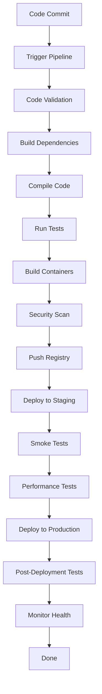

# CI/CD Pipeline Architecture for Craftplan MCP + A2A + elrmcp Integration

## Overview

This document outlines the comprehensive CI/CD pipeline architecture for integrating Craftplan MCP (Model Context Protocol) with A2A (Agent-to-Agent Protocol) and elrmcp (Erlang Resource Management Protocol) components.

## Architecture Components

### 1. Multi-Stage Build Pipeline

#### Build Stages:
1. **Code Checkout & Validation** - Static analysis, linting, security checks
2. **Dependency Management** - Download and cache dependencies
3. **Compilation** - Build Erlang/OTP releases
4. **Testing** - Unit, integration, and property-based tests
5. **Container Build** - Multi-stage Docker builds with optimization
6. **Security Scanning** - Vulnerability scanning and compliance checks
7. **Release Artifacts** - Create release packages and publish to registry

#### Container Registry:
- **Primary**: GitHub Container Registry (ghcr.io)
- **Backup**: Docker Hub
- **Multi-arch support**: AMD64, ARM64

### 2. Container Orchestration

#### Orchestrators:
- **Kubernetes**: Production deployment
- **Docker Swarm**: Development and staging
- **Local Docker**: Developer testing

#### Image Versioning Strategy:
- **Latest**: Always points to the latest successful build
- **Git SHA**: Specific commit builds
- **Semantic Versioning**: Release builds (v1.2.3)
- **Environment tags**: prod-staging-dev

### 3. Infrastructure Provisioning

#### Infrastructure as Code (IaC):
- **Terraform**: Cloud infrastructure provisioning
- **Helm**: Kubernetes deployment management
- **Kustomize**: Environment-specific configurations

#### Cloud Providers:
- **AWS**: EKS, S3, CloudWatch, ELB
- **GCP**: GKE, Cloud Storage, Cloud Monitoring
- **Azure**: AKS, Blob Storage, Monitor

### 4. Deployment Strategies

#### 4.1 Rolling Deployment
- **Description**: Gradually replace old versions with new ones
- **Strategy**: Update 1 pod at a time
- **Use Case**: Standard updates with minimal downtime
- **Configuration**:
  ```yaml
  rollingUpdate:
    maxSurge: 1
    maxUnavailable: 0
  ```

#### 4.2 Blue-Green Deployment
- **Description**: Run both old and new versions simultaneously
- **Strategy**: Deploy to green environment, switch traffic via load balancer
- **Use Case**: Zero-downtime deployments
- **Configuration**:
  ```yaml
  strategy:
    type: Recreate
  ```

#### 4.3 Canary Deployment
- **Description**: Deploy new version to a subset of users
- **Strategy**: Gradual traffic shift based on metrics
- **Use Case**: High-risk releases with gradual rollouts
- **Configuration**:
  ```yaml
  canary:
    replicas: 1
    trafficRouting:
      weight: 10%
  ```

#### 4.4 Zero-Downtime Deployment
- **Description**: No service interruption during deployment
- **Strategy**: Pre-warm new instances, switch traffic atomically
- **Use Case**: Mission-critical services

### 5. Monitoring and Logging

#### Monitoring Stack:
- **Prometheus**: Metrics collection and alerting
- **Grafana**: Visualization and dashboards
- **Alertmanager**: Alert routing and management

#### Logging Stack:
- **Loki**: Log aggregation
- **Promtail**: Log collection
- **Grafana**: Log visualization

#### Key Metrics:
- **Application**: HTTP response times, error rates, request counts
- **System**: CPU, memory, disk I/O, network
- **Business**: User activity, transaction success rates

### 6. Security and Compliance

#### Security Scanning:
- **Trivy**: Container vulnerability scanning
- **Dependabot**: Dependency vulnerability scanning
- **CodeQL**: Static application security testing

#### Compliance Checks:
- **CIS Benchmarks**: CIS Docker/ Kubernetes benchmarks
- **SOC 2**: Service Organization Control 2 compliance
- **GDPR**: General Data Protection Regulation compliance

### 7. Environment Management

#### Environments:
- **Development**: Local developer machines
- **Staging**: Pre-production environment
- **Production**: Live customer environment

#### Environment Isolation:
- **Network separation**: Separate VPCs/subnets per environment
- **Resource quotas**: Different resource limits per environment
- **Access controls**: Role-based access control (RBAC)

### 8. Pipeline Flow



### 9. Quality Gates

#### Build Quality:
- **Test Coverage**: Minimum 80% coverage
- **Code Quality**: Zero linting errors
- **Security**: Zero critical vulnerabilities
- **Performance**: Meet SLA targets

#### Deployment Quality:
- **Health Checks**: All pods must be ready
- **Response Time**: < 100ms for 95% of requests
- **Error Rate**: < 0.1%
- **Availability**: 99.95% uptime

### 10. Rollback Strategy

#### Automatic Rollback:
- **Health Check Failure**: Rollback after 3 consecutive failures
- **Performance Degradation**: Rollback if error rate > 5%
- **Response Time Degradation**: Rollback if response time > 2x baseline

#### Manual Rollback:
- **Rollback Command**: `kubectl rollout undo`
- **Blue-Green Rollback**: Switch traffic back to blue environment
- **Canary Rollback**: Terminate canary pods

### 11. Disaster Recovery

#### Backup Strategy:
- **Configuration**: Git-based versioning
- **Data**: Automated backups with versioning
- **Infrastructure**: Infrastructure-as-code backup

#### Recovery Procedures:
- **Application Recovery**: Automated deployment from last known good state
- **Database Recovery**: Point-in-time recovery
- **Infrastructure Recovery**: Terraform state-based recovery

### 12. Cost Optimization

#### Resource Optimization:
- **Autoscaling**: HPA and VPA for resource optimization
- **Spot Instances**: Use spot instances for non-critical workloads
- **Resource Limits**: Enforce resource limits to prevent over-provisioning

#### Build Optimization:
- **Caching**: Layer and build caching for faster builds
- **Parallel Builds**: Parallel compilation and testing
- **Selective Builds**: Build only changed components

## Implementation Roadmap

### Phase 1: Foundation (Week 1-2)
- Set up GitHub Actions workflows
- Configure Docker build process
- Implement basic testing pipeline
- Set up monitoring foundation

### Phase 2: Orchestration (Week 3-4)
- Configure Kubernetes infrastructure
- Implement Helm charts
- Set up environment management
- Implement basic deployment strategies

### Phase 3: Advanced Features (Week 5-6)
- Implement advanced deployment strategies
- Set up comprehensive monitoring
- Implement security scanning
- Add rollback capabilities

### Phase 4: Optimization (Week 7-8)
- Optimize build performance
- Implement cost optimization
- Add disaster recovery
- Documentation and training

## Success Metrics

### Build Metrics:
- **Build Time**: < 15 minutes for full pipeline
- **Success Rate**: > 99%
- **Cache Hit Rate**: > 80%

### Deployment Metrics:
- **Deployment Time**: < 10 minutes
- **Downtime**: < 30 seconds
- **Rollback Time**: < 5 minutes

### Operational Metrics:
- **Uptime**: 99.95%
- **Error Rate**: < 0.1%
- **Response Time**: < 100ms 95th percentile

This architecture provides a solid foundation for the Craftplan MCP + A2A + elrmcp integration with comprehensive CI/CD capabilities.