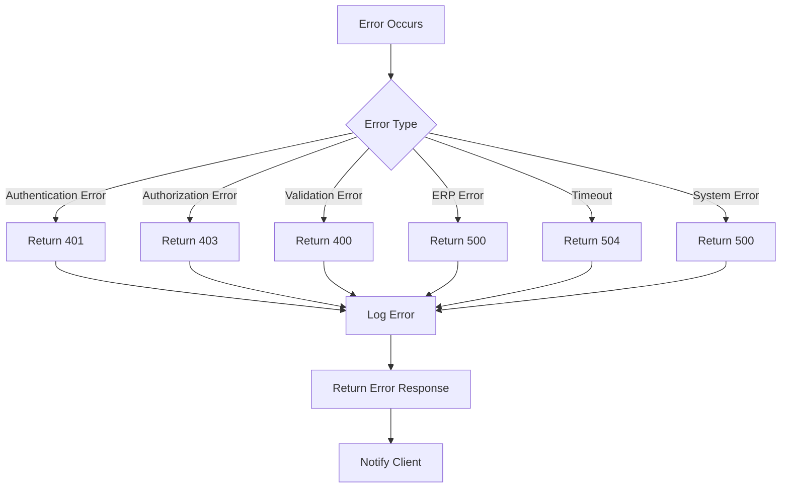

# Data Flow Diagrams

This document provides detailed data flow diagrams for the Craftplan MCP + A2A integration system, illustrating how data moves through the system during various operations.

## 🔄 High-Level Data Flow

### System Context Diagram
```
┌─────────────────────────────────────────────────────────────────────────┐
│                           EXTERNAL ENTITIES                             │
├─────────────────────────┬─────────────────────┬─────────────────────────┤
│  Client Applications    │   A2A Agents       │   Craftplan ERP System  │
│  (Claude, etc.)         │   (External)       │   (Backend)            │
└─────────────────────────┴─────────────────────┴─────────────────────────┘
                                │
                                ▼
┌─────────────────────────────────────────────────────────────────────────┐
│                           INTEGRATION SYSTEM                            │
├─────────────────────────┼─────────────────────┬─────────────────────────┤
│   MCP Server Layer      │   MCP-A2A Bridge   │   A2A Agent Layer      │
│   (Port 8090)           │   (Translation)     │   (Port 8080)          │
└─────────────────────────┴─────────────────────┴─────────────────────────┘
                                │
                                ▼
┌─────────────────────────────────────────────────────────────────────────┐
│                         SHARED SERVICES                                 │
├─────────────────────────┼─────────────────────┬─────────────────────────┤
│   API Client           │   Task Handler      │   Metrics Collection    │
│   (ERP Communication)   │   (Task Execution)  │   (Monitoring)         │
└─────────────────────────┴─────────────────────┴─────────────────────────┘
```

## 📋 Detailed Data Flows

### 1. MCP Tool Invocation Flow

```
┌─────────────┐    1. Tool Call    ┌─────────────────┐
│             │   (JSON-RPC 2.0)   │                 │
│  Client     ├───────────────────►│  MCP Server     │
│  Application│                    │  craftplan_     │
│             │                    │  mcp_server     │
└─────────────┘                    └────────┬────────┘
                                            │ 2. Tool Discovery
                                            ▼
┌─────────────┐    3. Bridge Call    ┌─────────────────┐
│             │   (Internal Msg)    │                 │
│  MCP Server ├───────────────────►│  MCP-A2A       │
│             │                    │  Bridge        │
└─────────────┘                    └────────┬────────┘
                                            │ 4. Skill Lookup
                                            ▼
┌─────────────┐    5. Task Submit    ┌─────────────────┐
│             │   (A2A Protocol)   │                 │
│  MCP-A2A    ├───────────────────►│  A2A Agent      │
│  Bridge     │                    │  craftplan_     │
│             │                    │  a2a_server    │
└─────────────┘                    └────────┬────────┘
                                            │ 6. Task Processing
                                            ▼
┌─────────────┐    7. API Call     ┌─────────────────┐
│             │   (HTTP/REST)     │                 │
│  A2A Agent  ├───────────────────►│  API Client     │
│             │                    │  craftplan_     │
│             │                    │  api_client     │
└─────────────┘                    └────────┬────────┘
                                            │ 8. ERP Request
                                            ▼
┌─────────────┐     9. ERP Call    ┌─────────────────┐
│             │   (HTTP/REST)     │                 │
│  API Client ├───────────────────►│  Craftplan ERP  │
│             │                    │  System         │
└─────────────┘                    └─────────────────┘

10. Response Flow (reverse path with data transformation):
Craftplan ERP → API Client → A2A Agent → MCP-A2A Bridge → MCP Server → Client
```

### 2. A2A Task Management Flow

```
┌─────────────┐    1. Task Submit    ┌─────────────────┐
│             │   (A2A Protocol)   │                 │
│  Agent A    ├───────────────────►│  Agent B        │
│  (Requester)│                    │  (Craftplan)    │
└─────────────┘                    └────────┬────────┘
                                            │ 2. Task Accept
                                            ▼
┌─────────────┐    3. Bridge Call    ┌─────────────────┐
│             │   (Internal Msg)    │                 │
│  A2A Agent  ├───────────────────►│  Task Handler   │
│             │                    │  craftplan_     │
│             │                    │  task_handler   │
└─────────────┘                    └────────┬────────┘
                                            │ 4. Task Execution
                                            ▼
┌─────────────┐    5. Tool Calls    ┌─────────────────┐
│             │   (MCP Protocol)   │                 │
│  Task Handler├───────────────────►│  MCP Server     │
│             │                    │  craftplan_     │
│             │                    │  mcp_server     │
└─────────────┘                    └────────┬────────┘
                                            │ 6. Bridge Translation
                                            ▼
┌─────────────┐    7. API Calls     ┌─────────────────┐
│             │   (HTTP/REST)      │                 │
│  MCP Server ├───────────────────►│  API Client     │
│             │                    │  craftplan_     │
│             │                    │  api_client     │
└─────────────┘                    └────────├─────────┘
                                             │ 8. ERP Calls
                                             ▼
┌─────────────┐    9. Response     ┌─────────────────┐
│             │   (HTTP/REST)     │                 │
│  API Client ├───────────────────►│  Task Handler   │
│             │                    │  craftplan_     │
│             │                    │  task_handler   │
└─────────────┘                    └────────┬─────────┘
                                             │ 10. Progress Update
                                             ▼
┌─────────────┐    11. Status     ┌─────────────────┐
│             │   (SSE Events)    │                 │
│  Task Handler├───────────────────►│  Agent A        │
│             │                    │  craftplan_     │
│             │                    │  sse_handler    │
└─────────────┘                    └────────┬─────────┘
                                             │ 12. Task Complete
                                             ▼
┌─────────────┐    13. Result     ┌─────────────────┐
│             │   (A2A Protocol) │                 │
│  A2A Agent  ├───────────────────►│  Agent A        │
│  craftplan_ │                    │                 │
│  a2a_server │                    └─────────────────┘
└─────────────┘
```

### 3. Authentication and Authorization Flow

```
┌─────────────┐    1. Auth Request  ┌─────────────────┐
│             │   (HTTP Header)    │                 │
│  Client     ├───────────────────►│  MCP Server     │
│             │                    │  craftplan_     │
└─────────────┘                    │  mcp_server     │
                                    └────────┬────────┘
                                            │ 2. Token Validation
                                            ▼
┌─────────────┐    3. Auth Check    ┌─────────────────┐
│             │   (Internal)       │                 │
│  MCP Server ├───────────────────►│  Auth Handler   │
│             │                    │                 │
└─────────────┘                    └────────┬─────────┘
                                             │ 4. Auth Decision
                                             ▼
┌─────────────┐    5. Access      ┌─────────────────┐
│             │   (Response)      │                 │
│  Auth Handler├───────────────────►│  MCP Server     │
│             │                    │                 │
└─────────────┘                    └────────┬─────────┘
                                             │ 6. Process Request
                                             ▼
┌─────────────┐    7. Auth Token   ┌─────────────────┐
│             │   (Bearer Token)   │                 │
│  MCP Server ├───────────────────►│  A2A Agent      │
│             │                    │  craftplan_     │
└─────────────┘                    │  a2a_server     │
                                    └────────┬─────────┘
                                            │ 8. A2A Auth
                                            ▼
┌─────────────┐    9. API Token   ┌─────────────────┐
│             │   (Header)        │                 │
│  A2A Agent  ├───────────────────►│  API Client     │
│             │                    │  craftplan_     │
│             │                    │  api_client     │
└─────────────┘                    └────────├─────────┘
                                             │ 10. ERP Auth
                                             ▼
┌─────────────┐    11. Request   ┌─────────────────┐
│             │   (HTTP/REST)     │                 │
│  API Client ├───────────────────►│  Craftplan ERP  │
│             │                    │  System         │
└─────────────┘                    └─────────────────┘
```

### 4. Streaming (SSE) Data Flow

```
┌─────────────┐    1. Connection    ┌─────────────────┐
│             │   (HTTP Upgrade)  │                 │
│  Client     ├───────────────────►│  SSE Handler    │
│             │                    │  craftplan_     │
└─────────────┘                    │  sse_handler    │
                                    └────────┬─────────┘
                                            │ 2. Connection Open
                                            ▼
┌─────────────┐    3. Subscribe    ┌─────────────────┐
│             │   (Task ID)       │                 │
│  Client     ├───────────────────►│  SSE Handler    │
│             │                    │                 │
└─────────────┘                    └────────┬─────────┘
                                             │ 4. Register Client
                                             ▼
┌─────────────┐    5. Monitor      ┌─────────────────┐
│             │   (Task Events)    │                 │
│  SSE Handler├───────────────────►│  Task Handler   │
│             │                    │  craftplan_     │
│             │                    │  task_handler   │
└─────────────┘                    └────────┬─────────┘
                                             │ 6. Event Generation
                                             ▼
┌─────────────┐    7. Event        ┌─────────────────┐
│             │   (SSE Format)     │                 │
│  Task Handler├───────────────────►│  SSE Handler    │
│             │                    │  craftplan_     │
│             │                    │  sse_handler    │
└─────────────┘                    └────────┬─────────┘
                                             │ 8. Broadcast
                                             ▼
┌─────────────┐    9. Push        ┌─────────────────┐
│             │   (HTTP Stream)    │                 │
│  SSE Handler├───────────────────►│  Client         │
│             │                    │                 │
└─────────────┘                    └─────────────────┘
```

## 📊 Data Transformation Points

### 1. MCP to A2A Translation
```erlang
%% MCP Tool Call
{
    "method": "tools/call",
    "params": {
        "name": "customer_management",
        "arguments": {
            "operation": "create",
            "customer_data": {
                "name": "John Doe",
                "email": "john@example.com"
            }
        }
    }
}

%% A2A Task Translation
{
    "type": "task",
    "skill": "customer_management",
    "parameters": {
        "operation": "create",
        "customer_data": {
            "name": "John Doe",
            "email": "john@example.com"
        }
    }
}
```

### 2. Response Transformation
```erlang
%% A2A Response
{
    "task_id": "task_123",
    "status": "completed",
    "result": {
        "success": true,
        "customer": {
            "id": "cust_456",
            "name": "John Doe",
            "email": "john@example.com"
        }
    }
}

%% MCP Response
{
    "result": {
        "success": true,
        "data": {
            "customer": {
                "id": "cust_456",
                "name": "John Doe",
                "email": "john@example.com"
            }
        }
    }
}
```

### 3. Error Handling Flow


## 🔄 State Management Flow

### 1. Task State Transitions
```
┌─────────────┐    ┌─────────────┐    ┌─────────────┐    ┌─────────────┐
│   Submitted │───▶│   Working   │───▶│  Completed  │
└─────────────┘    └─────────────┘    └─────────────┘    └─────────────┘
       ▲                ▲                ▲                ▲
       │                │                │                │
       │ Failed         │ Input Required  │ Canceled       │ Auth Required
       │                │                │                │
       ▼                ▼                ▼                ▼
┌─────────────┐    ┌─────────────┐    ┌─────────────┐    ┌─────────────┐
│    Failed  │    │ Input Required│    │  Canceled   │    │ Auth Required│
└─────────────┘    └─────────────┘    └─────────────┘    └─────────────┘
```

### 2. Session State Management
```
┌─────────────┐    ┌─────────────┐    ┌─────────────┐    ┌─────────────┐
│   Client    │    │   MCP       │    │   Bridge    │    │   A2A       │
│   Session   │    │   Session   │    │   Session   │    │   Session   │
└─────────────┘    └─────────────┘    └─────────────┘    └─────────────┘
       │                │                │                │
       │                │                │                │
       ▼                ▼                ▼                ▼
┌─────────────┐    ┌─────────────┐    ┌─────────────┐    ┌─────────────┐
│   Session   │    │   Session   │    │   Session   │    │   Session   │
│   Store     │    │   Store     │    │   Store     │    │   Store     │
└─────────────┘    └─────────────┘    └─────────────┘    └─────────────┘
```

These data flow diagrams illustrate the complex interactions between components in the Craftplan MCP + A2A integration system. Each flow shows how data is transformed and routed through the system, ensuring proper protocol compliance and maintaining consistency across different layers.