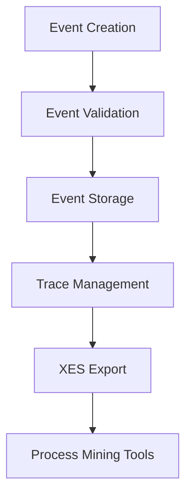

# YAWL XES/OCEL Logging Reference

## Overview

The YAWL XES Logger implements the IEEE 1849-2016 XES (eXtensible Event Stream) standard for comprehensive workflow event logging. It supports both XES standard logging and OCEL (Open Events for Case Life Cycle) patterns, providing powerful capabilities for process mining, workflow analysis, and audit trail management.

## XES Standard Compliance

The logger fully complies with the IEEE 1849-2016 XES standard, implementing all required and recommended features:

- **concept:name** - Event/activity names
- **concept:instance** - Instance identifiers for trace grouping
- **lifecycle:transition** - Lifecycle states (start, complete, abort, etc.)
- **time:timestamp** - ISO 8601 timestamps
- **case:id** - Case identifiers for trace grouping
- **Custom attributes** - Extensible data attributes

## Architecture

### Components

1. **XES Log Manager** - Manages multiple logs, traces, and event storage
2. **Event Logger** - Handles high-performance event recording with async processing
3. **XES Formatter** - Converts internal data to XES XML format
4. **Case Manager** - Handles OCEL-style case lifecycle management
5. **Performance Optimizer** - Batch processing and memory management

### Data Flow



## API Reference

### Log Management

#### Log Lifecycle

```erlang
%% Start the XES logger with default configuration
-spec start_link() -> {ok, pid()} | {error, term()}

%% Start the XES logger with custom name
-spec start_link(atom()) -> {ok, pid()} | {error, term()}

%% Stop the XES logger
-spec stop() -> ok

%% Create a new XES log with default metadata
-spec new_log() -> {ok, log_id()}

%% Create a new XES log with custom metadata
-spec new_log(map()) -> {ok, log_id()}

%% Get log by ID
-spec get_log(log_id()) -> {ok, #xes_log{}} | {error, not_found}

%% List all logs
-spec list_logs() -> [{log_id(), #xes_log{}}]

%% Delete a log
-spec delete_log(log_id()) -> ok | {error, not_found}
```

**Example:**
```erlang
%% Start logger
{ok, LoggerPid} = yawl_xes_logger:start_link().

%% Create log with metadata
Metadata = #{workflow_type => "order_processing", version => "1.0"},
{ok, LogId} = yawl_xes_logger:new_log(Metadata).

%% Get log details
{ok, Log} = yawl_xes_logger:get_log(LogId).
```

### Event Logging Functions

#### Pattern Events

```erlang
%% Log pattern execution start
-spec log_pattern_start(log_id(), binary(), binary()) -> ok

%% Log pattern execution completion
-spec log_pattern_complete(log_id(), binary(), binary(), term()) -> ok
```

**Parameters:**
- `LogId` - Unique identifier for the log
- `PatternType` - Type of pattern being executed (binary)
- `PatternId` - Unique identifier for this pattern instance (binary)
- `Result` - Result data (for completion events)

**Example:**
```erlang
%% Log pattern start
yawl_xes_logger:log_pattern_start(LogId, <<"parallel_split">>, <<"order_split_123">>).

%% Log pattern completion with result
Result = #{branches_completed => 4, total_duration => 5000},
yawl_xes_logger:log_pattern_complete(LogId, <<"parallel_split">>, <<"order_split_123">>, Result).
```

#### Work Item Events

```erlang
%% Log work item start
-spec log_workitem_start(log_id(), binary(), binary()) -> ok

%% Log work item completion
-spec log_workitem_complete(log_id(), binary(), binary(), term()) -> ok
```

**Parameters:**
- `LogId` - Log identifier
- `WorkitemId` - Unique work item identifier
- `TaskId` - Task identifier
- `Result` - Completion result data

**Example:**
```erlang
%% Log work item start
yawl_xes_logger:log_workitem_start(LogId, <<"workitem_456">>, <<"process_payment">>).

%% Log work item completion
Result = #{payment_id => "pay_789", amount => 99.99, status => success},
yawl_xes_logger:log_workitem_complete(LogId, <<"workitem_456">>, <<"process_payment">>, Result).
```

#### Case Events (OCEL Support)

```erlang
%% Log case start
-spec log_case_start(log_id(), case_id()) -> ok

%% Log case completion with statistics
-spec log_case_complete(log_id(), case_id(), map()) -> ok
```

**Parameters:**
- `LogId` - Log identifier
- `CaseId` - Unique case identifier
- `Stats` - Case completion statistics

**Example:**
```erlang
%% Log case start
CaseId = <<"order_case_999">>,
yawl_xes_logger:log_case_start(LogId, CaseId).

%% Log case completion with metrics
Stats = #{duration => 45000, cost => 125.50, events => 12, errors => 0},
yawl_xes_logger:log_case_complete(LogId, CaseId, Stats).
```

#### Generic Events

```erlang
%% Log generic event without case ID
-spec log_event(log_id(), binary(), binary(), map()) -> ok

%% Log generic event with optional case ID
-spec log_event(log_id(), binary(), binary(), map(), binary() | undefined) -> ok
```

**Parameters:**
- `LogId` - Log identifier
- `ConceptName` - Event concept name
- `LifecycleTransition` - Event lifecycle state
- `Data` - Event data map
- `CaseId` - Optional case identifier

**Example:**
```erlang
%% Log generic event
EventData = #{error_type => "validation", message => "Invalid input"},
yawl_xes_logger:log_event(LogId, <<"validation_error">>, <<"abort">>, EventData).

%% Log generic event with case context
EventData = #{notes => "Manual review required"},
yawl_xes_logger:log_event(LogId, <<"manual_review">>, <<"start">>, EventData, CaseId).
```

### XES Export Functions

#### File Export

```erlang
%% Export log to XES XML file with default directory
-spec export_xes(log_id()) -> {ok, file:filename()} | {error, term()}

%% Export log to XES XML file with specified directory
-spec export_xes(log_id(), string()) -> {ok, file:filename()} | {error, term()}
```

**Example:**
```erlang
%% Export with default directory (xes_logs/)
{ok, FilePath} = yawl_xes_logger:export_xes(LogId).

%% Export to custom directory
{ok, FilePath} = yawl_xes_logger:export_xes(LogId, "/path/to/logs").
```

#### String Export

```erlang
%% Export log to XES XML format as string
-spec export_xes_to_string(log_id()) -> {ok, binary()} | {error, term()}
```

**Example:**
```erlang
%% Export to string for network transmission
{ok, XesString} = yawl_xes_logger:export_xes_to_string(LogId).
```

## XES Event Structure

### Event Record Definition

```erlang
-record(xes_event, {
    event_id :: binary(),          % Unique event identifier
    timestamp :: integer(),         % Milliseconds since epoch
    case_id :: binary() | undefined, % Optional case identifier
    concept :: map(),               % Concept:name and concept:instance
    lifecycle :: map(),             % lifecycle:transition
    data :: map()                  % Additional event data
}).
```

### Standard XES Attributes

#### Concept Attributes

```erlang
concept = #{
    <<"concept:name">> => <<"order_processing">>,
    <<"concept:instance">> => <<"order_12345">>
}.
```

#### Lifecycle Attributes

```erlang
lifecycle = #{
    <<"lifecycle:transition">> => <<"complete">>,
    <<"lifecycle:phase">> => <<"finished">>
}.
```

#### Time Attributes

```erlang
data = #{
    <<"time:timestamp">> => <<"2024-01-15T10:30:00Z">>,
    <<"time:duration">> => 5000
}.
```

#### Custom Attributes

```erlang
data = #{
    <<"user_id">> => <<"user_456">>,
    <<"cost">> => 99.99,
    <<"priority">> => high,
    <<"metadata">> => #{department => "sales"}
}.
```

## OCEL Integration

### OCEL Event Mapping

The logger supports OCEL (Open Events for Case Life Cycle) patterns by automatically mapping XES events to OCEL structure:

```erlang
%% OCEL-compliant event structure
#{
    id => EventId,
    caseId => CaseId,
    activityName => ActivityName,
    startTime => Timestamp,
    endTime => Timestamp,
    lifecycleTransition => Transition,
    properties => EventData
}.
```

### Case Lifecycle Management

```erlang
%% Create OCEL-style case
CaseId = generate_case_id(),
yawl_xes_logger:log_case_start(LogId, CaseId).

%% Log case events
EventData = #{object_type => "order", priority => high},
yawl_xes_logger:log_event(LogId, <<"order_created">>, <<"start">>, EventData, CaseId).

%% Complete case
Stats = #{events => 15, duration => 30000},
yawl_xes_logger:log_case_complete(LogId, CaseId, Stats).
```

## Performance Optimization

### Batch Event Processing

```erlang
%% Configure batch processing
application:set_env(a2a_erl, xes_batch_size, 1000).
application:set_env(a2a_erl, xes_batch_timeout, 1000).
```

### Memory Management

```erlang
%% Configure memory limits
application:set_env(a2a_erl, xes_max_events_per_log, 100000).
application:set_env(a2a_erl, xes_cleanup_interval, 3600000).
```

### Async Logging

```erlang
%% Enable async mode for high throughput
yawl_xes_logger:configure_async(true).

%% Check async queue status
Status = yawl_xes_logger:get_async_queue_status().
```

## Configuration Options

### Application Configuration

```erlang
%% In sys.config
{a2a_erl, [
    {xes_output_dir, "xes_logs"},       % Output directory for XES files
    {xes_batch_size, 1000},             % Batch size for async processing
    {xes_batch_timeout, 1000},          % Batch timeout in milliseconds
    {xes_max_events_per_log, 100000},   % Maximum events per log
    {xes_cleanup_interval, 3600000},    % Cleanup interval in milliseconds
    {xes_compression_level, 6},         % XES file compression (0-9)
    {xes_enable_timestamps, true},       % Enable detailed timestamps
    {xes_trace_level, fine}              % Trace level for debugging
]}.
```

### Runtime Configuration

```erlang
%% Set output directory
yawl_xes_logger:set_output_dir("/custom/path/logs").

%% Enable compression
yawl_xes_logger:set_compression(true).

%% Get current configuration
Config = yawl_xes_logger:get_configuration().
```

## Error Handling

### Common Error Codes

- `{error, not_found}` - Log ID not found
- `{error, invalid_event_data}` - Invalid event structure
- `{error, disk_full}` - Insufficient disk space
- `{error, export_failed}` - XES export failed
- `{error, async_overflow}` - Async queue overflow

### Error Recovery

```erlang
%% Handle export errors
case yawl_xes_logger:export_xes(LogId) of
    {error, Reason} ->
        %% Retry or fallback
        handle_export_error(LogId, Reason);
    {ok, FilePath} ->
        %% Success handling
        handle_export_success(FilePath)
end.
```

## Usage Examples

### Complete Workflow Logging

```erlang
%% Start logger and create log
{ok, _LoggerPid} = yawl_xes_logger:start_link().
{ok, LogId} = yawl_xes_logger:new_log(#{workflow_type => "order_processing"}).

%% Log workflow lifecycle
yawl_xes_logger:log_case_start(LogId, <<"order_123">>).

%% Log pattern execution
yawl_xes_logger:log_pattern_start(LogId, <<"parallel_split">>, <<"split_456">>).

%% Log work items
yawl_xes_logger:log_workitem_start(LogId, <<"item_789">>, <<"process_payment">>).

%% Complete work item
Result = #{payment_id => "pay_101", amount => 99.99},
yawl_xes_logger:log_workitem_complete(LogId, <<"item_789">>, <<"process_payment">>, Result).

%% Complete pattern
yawl_xes_logger:log_pattern_complete(LogId, <<"parallel_split">>, <<"split_456">>,
    #{branches => 4, duration => 5000}).

%% Complete workflow
Stats = #{events => 12, duration => 30000, cost => 125.50},
yawl_xes_logger:log_case_complete(LogId, <<"order_123">>, Stats).

%% Export to file
{ok, XesFile} = yawl_xes_logger:export_xes(LogId, "/path/to/logs").
```

### Process Mining Integration

```erlang
%% Export for ProM
{ok, XesString} = yawl_xes_logger:export_xes_to_string(LogId).

%% Send to process mining service
send_to_prom(XesString, "http://prom-server/api/import").

%% Generate statistics
Stats = yawl_xes_logger:get_log_statistics(LogId),
#{total_events => 45, case_count => 10, avg_duration => 25000} = Stats.
```

### Multi-Log Management

```erlang
%% Create multiple logs for different workflows
{ok, OrderLogId} = yawl_xes_logger:new_log(#{workflow_type => "order"}).
{ok, PaymentLogId} = yawl_xes_logger:new_log(#{workflow_type => "payment"}).

%% Log to appropriate logs
yawl_xes_logger:log_event(OrderLogId, <<"order_created">>, <<"start">>,
    #{customer_id => "cust_123"}).

yawl_xes_logger:log_event(PaymentLogId, <<"payment_processed">>, <<"complete">>,
    #{amount => 99.99, method => "credit_card"}).

%% Export logs separately
{ok, OrderFile} = yawl_xes_logger:export_xes(OrderLogId).
{ok, PaymentFile} = yawl_xes_logger:export_xes(PaymentLogId).
```

## Integration with Process Mining Tools

### ProM Integration

```erlang
%% Export in ProM-compatible format
{ok, XesString} = yawl_xes_logger:export_xes_to_string(LogId).

%% Convert to ProM format using Python bridge
case yawl_cpn:call_pm4py(convert_to_prom, [XesString]) of
    {ok, PromFormat} ->
        %% Send to ProM
        send_to_prom(PromFormat);
    {error, Reason} ->
        %% Fallback to standard XES
        handle_fallback_export()
end.
```

### PM4Py Integration

```erlang
%% Load log in PM4Py
case yawl_cpn:process_discovery(XesString) of
    {ok, DiscoveredModel} ->
        %% Analyze process model
        analyze_process_model(DiscoveredModel);
    {error, Reason} ->
        %% Handle error
        io:format("Process discovery failed: ~p~n", [Reason])
end.
```

## Troubleshooting

### Common Issues

1. **Export Failures**
   ```erlang
   %% Check disk space
   {ok, SpaceInfo} = file:read_file_info("/path/to/logs").

   %% Ensure write permissions
   case file:write_file("/path/to/logs/test", "test") of
       {error, eacces} ->
           %% Permission issue
           fix_permissions();
       _ -> ok
   end.
   ```

2. **Memory Issues**
   ```erlang
   %% Check log size
   {ok, Log} = yawl_xes_logger:get_log(LogId),
   EventCount = length(Log#xes_log.events).

   %% Cleanup old logs
   if EventCount > 100000 ->
           yawl_xes_logger:delete_log(LogId);
       true -> ok
   end.
   ```

3. **Performance Issues**
   ```erlang
   %% Enable batching
   application:set_env(a2a_erl, xes_batch_size, 5000).

   %% Monitor performance
   Stats = yawl_xes_logger:get_performance_stats(),
   #{events_per_second => 125, memory_usage => 1048576} = Stats.
   ```

### Debug Mode

```erlang
%% Enable debug logging
application:set_env(a2a_erl, xes_trace_level, debug).

%% Log debug information
yawl_xes_logger:log_debug(DebugInfo).

%% Check performance metrics
Metrics = yawl_xes_logger:get_performance_metrics().
```

## Best Practices

1. **Event Design**
   - Use consistent naming conventions
   - Include relevant business context
   - Minimize event size for performance
   - Use appropriate lifecycle transitions

2. **Log Management**
   - Monitor log sizes and implement cleanup
   - Use descriptive metadata
   - Implement proper error handling
   - Regular export and archival

3. **Performance**
   - Use batch processing for high volumes
   - Configure appropriate timeouts
   - Monitor memory usage
   - Consider compression for large logs

4. **Security**
   - Sanitize event data before logging
   - Implement access controls for sensitive logs
   - Encrypt sensitive data in event logs
   - Implement audit trails for log access

5. **Integration**
   - Standardize event formats across systems
   - Test export with target process mining tools
   - Implement proper error handling for integrations
   - Monitor integration health